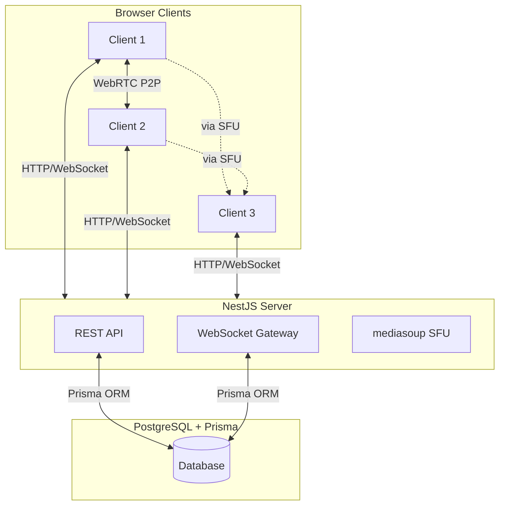
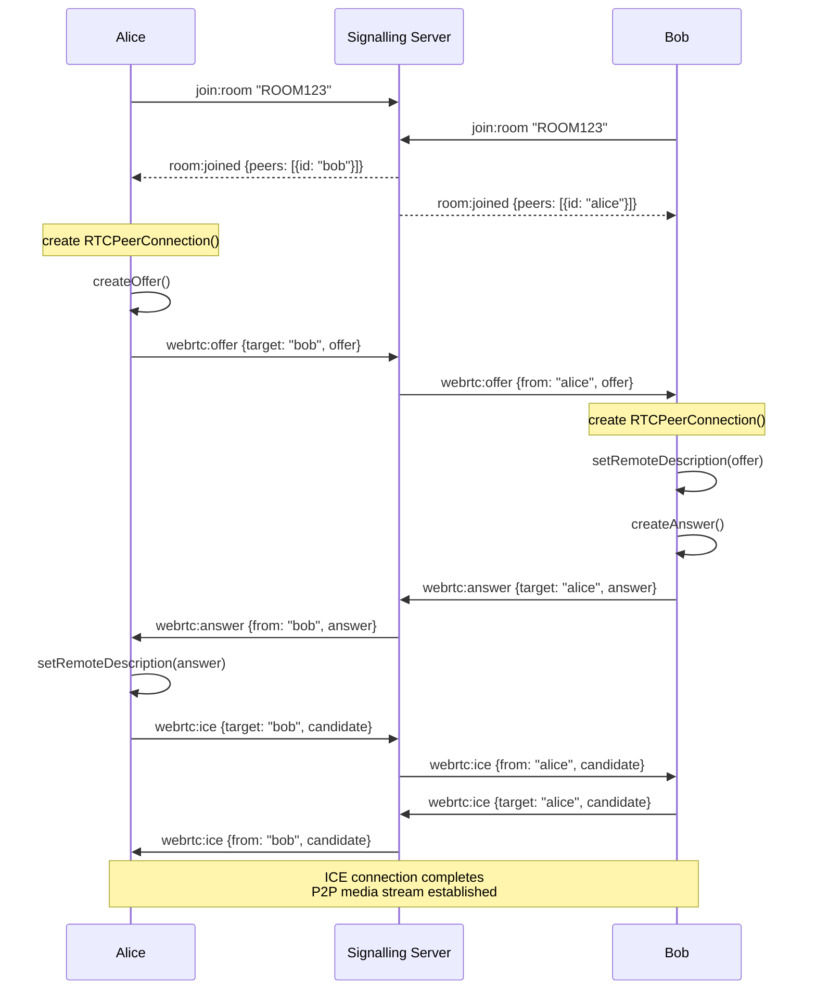
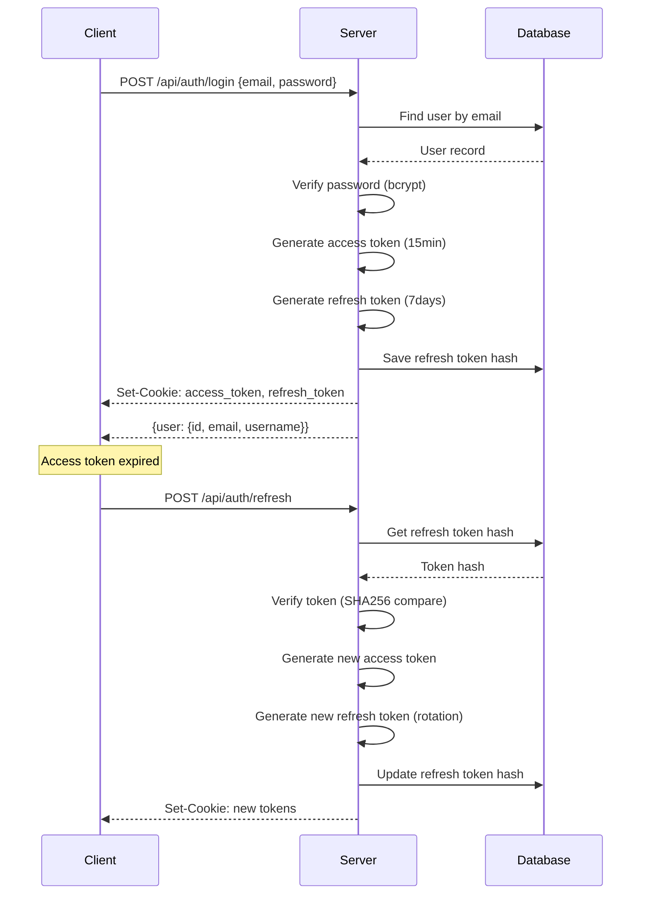

# Software Design Document: WebRTC Chat

> **Version:** 1.1
>
> **Date:** 2025-02-07 / Updated: 2026-02-08
>
> **Status:** Draft

---

## Documentation Index

| Document | Purpose | Location |
|----------|---------|----------|
| **Architecture Overview** | High-level system design and tech stack | [architecture/overview.md](./architecture/overview.md) |
| **Module Documentation** | Detailed module specifications | [modules/](./modules/) |
| **Roadmap** | Implementation phases and task list | [roadmap.md](./roadmap.md) |
| **Agent Guide** | Guidelines for AI agents | [agent-guide.md](./agent-guide.md) |
| **Tasks** | Individual task specifications | [tasks/](./tasks/) |
| **Implementation Guides** | Step-by-step tutorials (Russian) | [tasks/phase-*/](./tasks/) |

---

## 1. Introduction

### 1.1 Purpose

This document describes the architecture, design, and technical decisions for the WebRTC Chat application — a browser-based video conferencing system similar to Google Meet.

> **Note:** For module-specific details, see the [Module Documentation](./modules/). For implementation tasks, see the [Roadmap](./roadmap.md).

### 1.2 Scope

The WebRTC Chat application provides:

- **Video Calls** — 1-on-1 and group calls (up to 10+ participants)
- **Text Chat** — Real-time messaging with history
- **Screen Sharing** — Share desktop or application window
- **Device Management** — Switch between cameras, microphones, and speakers
- **User Authentication** — Registration, login, and session management

### 1.3 Definitions

| Term | Definition |
|------|------------|
| **WebRTC** | Web Real-Time Communication — API for peer-to-peer audio/video |
| **SFU** | Selective Forwarding Unit — Server for routing media in group calls |
| **STUN** | Session Traversal Utilities for NAT — Discovers public IP |
| **TURN** | Traversal Using Relays around NAT — Relay server for direct connection failures |
| **Signalling** | Process of exchanging connection info (offer/answer/ICE) via WebSocket |
| **JWT** | JSON Web Token — Stateless authentication token |
| **Prisma** | ORM for type-safe database access |

---

## 2. System Architecture

### 2.1 High-Level Architecture



### 2.2 Component Overview

| Component | Description | Location |
|-----------|-------------|----------|
| **AuthModule** | JWT authentication with refresh token rotation | `apps/server/src/auth/` |
| **UserModule** | User management via Prisma | `apps/server/src/user/` |
| **PrismaModule** | Global database service | `apps/server/src/prisma/` |
| **GatewayModule** | WebSocket signalling (planned) | `apps/server/src/gateway/` |
| **SFUModule** | mediasoup for group calls (planned) | `apps/server/src/sfu/` |
| **Client App** | React 19 + Vite frontend | `apps/client/src/` |

### 2.3 Technology Stack

**Backend:**
- **Framework:** NestJS (Node.js)
- **Database:** PostgreSQL 16
- **ORM:** Prisma
- **WebSocket:** Socket.io (planned)
- **WebRTC:** mediasoup SFU (planned)
- **Auth:** Passport.js + JWT

**Frontend:**
- **Framework:** React 19
- **Build Tool:** Vite
- **Routing:** React Router v7 (file-based)
- **Styling:** Tailwind CSS v4
- **UI Components:** Radix UI
- **Forms:** React Hook Form + Zod
- **WebRTC:** Native RTCPeerConnection API

---

## 3. Data Design

### 3.1 Data Models

```prisma
model User {
  id                  String    @id @default(cuid())
  email               String    @unique
  username            String    @unique
  passwordHash        String
  refreshTokenHash    String?
  failedLoginAttempts Int       @default(0)
  lockedUntil         DateTime?
  tokenVersion        Int       @default(0)
  createdAt           DateTime  @default(now())
  updatedAt           DateTime  @updatedAt

  // Relations (planned)
  // rooms      Room[]     @relation("RoomHost")
  // messages   Message[]
}

// Planned models
// model Room {
//   id        String    @id @default(cuid())
//   slug      String    @unique
//   name      String
//   hostId    String
//   host      User      @relation("RoomHost", fields: [hostId], references: [id])
//   messages  Message[]
//   createdAt DateTime  @default(now())
//   updatedAt DateTime  @updatedAt
// }

// model Message {
//   id        String   @id @default(cuid())
//   content   String
//   userId    String
//   user      User     @relation(fields: [userId], references: [id])
//   roomId    String
//   room      Room     @relation(fields: [roomId], references: [id])
//   createdAt DateTime @default(now())
// }
```

### 3.2 Database Schema

| Table | Columns | Indexes |
|-------|---------|---------|
| `User` | id, email, username, passwordHash, refreshTokenHash, failedLoginAttempts, lockedUntil, tokenVersion, createdAt, updatedAt | email (unique), username (unique) |

---

## 4. Interface Design

### 4.1 REST API

#### Authentication Endpoints

| Method | Path | Auth | Description |
|--------|------|------|-------------|
| POST | `/api/auth/register` | Public | Register new user |
| POST | `/api/auth/login` | Public | Login with email/password |
| POST | `/api/auth/refresh` | Public | Refresh access token |
| POST | `/api/auth/logout` | Protected | Invalidate refresh token |

#### User Endpoints

| Method | Path | Auth | Description |
|--------|------|------|-------------|
| GET | `/api/users/me` | Protected | Get current user profile |

#### Room Endpoints (planned)

| Method | Path | Auth | Description |
|--------|------|------|-------------|
| GET | `/api/rooms` | Protected | List user's rooms |
| POST | `/api/rooms` | Protected | Create new room |
| GET | `/api/rooms/:slug` | Public | Get room by slug |

#### Request/Response Examples

**Register Request:**
```json
POST /api/auth/register
{
  "email": "user@example.com",
  "username": "johndoe",
  "password": "SecurePass123"
}
```

**Login Response:**
```json
HTTP 200 OK
Set-Cookie: access_token=...; HttpOnly; Secure; SameSite=Strict; Max-Age=900
Set-Cookie: refresh_token=...; HttpOnly; Secure; SameSite=Strict; Max-Age=604800

{
  "user": {
    "id": "clx...",
    "email": "user@example.com",
    "username": "johndoe"
  }
}
```

### 4.2 WebSocket Events (planned)

| Event | Direction | Payload | Description |
|-------|-----------|---------|-------------|
| `join:room` | Client → Server | `{ roomCode: string }` | Join a room |
| `leave:room` | Client → Server | — | Leave current room |
| `room:joined` | Server → Client | `{ roomId, peerId, peers[] }` | Room joined confirmation |
| `peer:joined` | Server → Client | `{ peerId, userInfo }` | New peer joined |
| `peer:left` | Server → Client | `{ peerId }` | Peer left room |
| `webrtc:offer` | Bidirectional | `{ targetPeerId, offer }` | WebRTC offer |
| `webrtc:answer` | Bidirectional | `{ targetPeerId, answer }` | WebRTC answer |
| `webrtc:ice` | Bidirectional | `{ targetPeerId, candidate }` | ICE candidate |

### 4.3 Frontend Routes

| Route | Component | Auth Required |
|-------|-----------|---------------|
| `/` | Lobby | No |
| `/login` | Login Page | No (redirect if authenticated) |
| `/register` | Register Page | No (redirect if authenticated) |
| `/room/:code` | Video Room | Optional |

---

## 5. Component Design

### 5.1 Backend Modules

#### AuthModule

**Responsibilities:**
- User registration with password hashing (bcrypt)
- Login with JWT token generation
- Refresh token rotation on every use
- Token reuse detection (timing-safe comparison)
- Account lockout after failed attempts

**Key Classes:**
- `AuthService` — Core auth logic
- `LocalStrategy` — Passport strategy for email/password
- `JwtStrategy` — Passport strategy for access token validation
- `JwtRefreshStrategy` — Passport strategy for refresh token validation

**Security Features:**
- Passwords hashed with bcrypt (10 rounds)
- Access tokens expire in 15 minutes
- Refresh tokens expire in 7 days
- Tokens stored in HTTP-only cookies
- Refresh tokens hashed in database (SHA256)

#### UserModule

**Responsibilities:**
- CRUD operations for User entity
- User lookup by email/username/id

#### PrismaModule

**Responsibilities:**
- Global Prisma service injection
- Database connection management
- `@Global()` decorator makes service available everywhere

### 5.2 Frontend Architecture

**Pages:**
- `LobbyPage` (`/`) — Room join/create, auth-aware navigation
- `LoginPage` (`/login`) — Email/password login form
- `RegisterPage` (`/register`) — Registration with password confirmation
- `RoomPage` (`/room/:code`) — Video call interface

**Features:**
- `AuthContext` — Global auth state with `useAuth()` hook
- `authApi` — API client with automatic token refresh on 401
- `ProfileDropdown` — User menu with logout

**UI Components (Radix UI):**
- `Button` — Primary/secondary/outline/ghost variants
- `Input` — Text input with label integration
- `Card` — Container component
- `Label` — Form label with accessibility

---

## 6. Security

### 6.1 Authentication

**Flow:**
1. User submits email/password to `/api/auth/login`
2. Server validates credentials
3. Server generates JWT access token (15min) + refresh token (7days)
4. Tokens set as HTTP-only cookies
5. Client sends cookies automatically with requests

**Token Structure:**
```typescript
// Access Token Payload
{
  sub: string,      // User ID
  email: string,
  username: string,
  tokenVersion: number,
  iat: number,
  exp: number
}

// Refresh Token Payload
{
  sub: string,      // User ID
  jti: string,      // JWT ID (unique token identifier)
  iat: number,
  exp: number
}
```

### 6.2 Authorization

**Guards:**
- `JwtAuthGuard` — Protects endpoints requiring authentication
- `SkipAuthGuard` — Marks public endpoints (default behavior)

**Usage:**
```typescript
@UseGuards(JwtAuthGuard)
@Get('me')
getProfile(@Request() req) {
  return req.user;
}
```

### 6.3 WebRTC Security

**STUN Servers:**
```typescript
{
  urls: "stun:stun.l.google.com:19302"
}
```

**TURN (Production):**
- coturn server for relay candidates
- Required for connections behind symmetric NAT

**Encryption:**
- SRTP (Secure Real-time Transport Protocol) for media
- DTLS (Datagram Transport Layer Security) for data channels

---

## 7. Performance

### 7.1 Requirements

| Metric | Target |
|--------|--------|
| Video latency | < 200ms (P2P) |
| Audio latency | < 150ms (P2P) |
| Chat message delivery | < 100ms |
| UI frame rate | 60fps with 10+ video tiles |
| API response time | < 200ms (p95) |

### 7.2 Monitoring

**WebRTC Stats:**
```typescript
const stats = await peerConnection.getStats();
// Track: bitrate, packetLoss, jitter, roundTripTime
```

**Network Quality Indicators:**
- Bandwidth (estimated)
- Latency (RTT)
- Packet loss rate

---

## 8. Scalability

### 8.1 SFU Architecture (planned)

**mediasoup Components:**
- **Worker** — OS process with media capabilities
- **Router** — Routes media for a room
- **Transport** — RTP stream (send/receive)
- **Producer** — Incoming media track
- **Consumer** — Outgoing media track

**Scaling Strategy:**
- 1 Router per room
- Multiple Workers per server (CPU cores)
- Horizontal scaling via load balancer

### 8.2 Horizontal Scaling

**Stateless Servers:**
- JWT tokens (stateless auth)
- Redis adapter for Socket.io (WebSocket state sync)
- PostgreSQL connection pooling

**Infrastructure:**
```
┌─────────────┐     ┌─────────────┐
│   Client    │────▶│   LB / Caddy│
└─────────────┘     └─────────────┘
                            │
                ┌───────────┼───────────┐
                ▼           ▼           ▼
           ┌────────┐ ┌────────┐ ┌────────┐
           │ Server │ │ Server │ │ Server │
           └────────┘ └────────┘ └────────┘
                │           │           │
                └───────────┼───────────┘
                            ▼
                      ┌──────────┐
                      │  Redis   │
                      └──────────┘
                            │
                            ▼
                      ┌──────────┐
                      │PostgreSQL│
                      └──────────┘
```

---

## 9. Deployment

### 9.1 Local Development

**Database:**
```bash
docker compose up -d  # PostgreSQL + pgAdmin
pnpm migrate:dev      # Run Prisma migrations
```

**Server:**
```bash
cd apps/server
pnpm start:dev       # Watch mode with hot reload
```

**Client:**
```bash
cd apps/client
pnpm dev             # Vite dev server on port 5173
```

### 9.2 Production (planned)

- **Reverse Proxy:** Caddy (automatic HTTPS)
- **TURN Server:** coturn
- **Process Manager:** PM2
- **Database:** Managed PostgreSQL (e.g., Railway, Supabase)

---

## 10. References

- [WebRTC MDN Documentation](https://developer.mozilla.org/en-US/docs/Web/API/WebRTC_API)
- [NestJS Documentation](https://docs.nestjs.com/)
- [Prisma Documentation](https://www.prisma.io/docs/)
- [mediasoup Documentation](https://mediasoup.org/documentation/v3/)
- [Socket.io Documentation](https://socket.io/docs/)

---

## Appendix A: Sequence Diagrams

### WebRTC P2P Handshake (planned)



### Authentication Flow



---

**Document History:**

| Version | Date | Author | Changes |
|---------|------|--------|---------|
| 1.0 | 2025-02-07 | — | Initial SDD creation |
