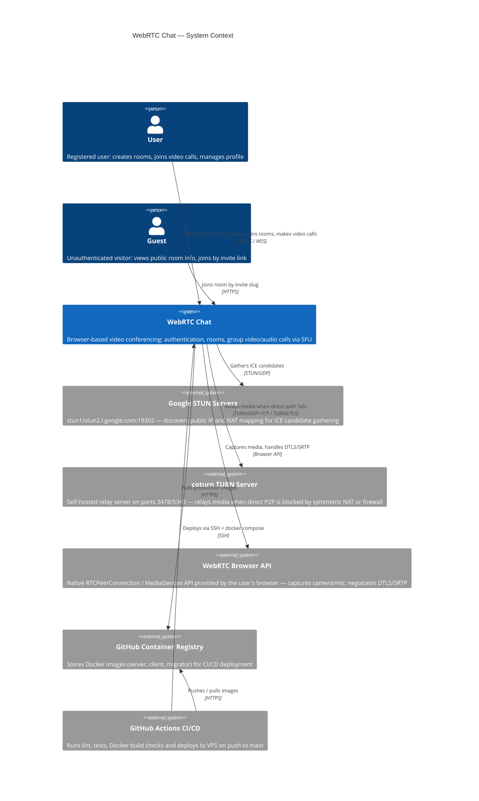

# C4 Level 1 — System Context

> Кто использует систему и с какими внешними системами она взаимодействует.



## Text Diagram

```
┌─────────────────────────────────────────────────────────────────────┐
│                         EXTERNAL ACTORS                             │
│                                                                     │
│   [User]                              [Guest]                       │
│   Registered user                     Unauthenticated visitor       │
│   (auth, rooms, video calls)          (join by invite slug)         │
└────────────────────┬──────────────────────────┬────────────────────┘
                     │ HTTPS / WSS               │ HTTPS
                     ▼                           ▼
         ┌───────────────────────────────────────────────┐
         │                                               │
         │              WebRTC Chat                      │
         │   Browser-based video conferencing            │
         │   (Auth · Rooms · SFU video calls)            │
         │                                               │
         └──────┬──────────────┬────────────────┬────────┘
                │ STUN/UDP     │ TURN/UDP+TCP    │ HTTPS
                ▼              ▼                 ▼
   [Google STUN Servers]  [coturn TURN]    [GitHub GHCR]
   ICE candidate          Self-hosted      Docker image
   gathering              media relay      registry
   stun1/stun2            ports 3478/5349

         ▲
         │ SSH deploy
   [GitHub Actions CI/CD]
   lint · tests · build · deploy to VPS
```

## External Actors

| Actor | Description |
|-------|-------------|
| **User** | Registered user — full access: authentication, room management, video calls |
| **Guest** | Unauthenticated visitor — can view public room info and join by invite link |

## External Systems

| System | Role |
|--------|------|
| **Google STUN** | ICE candidate gathering — discovers public IP/port |
| **coturn TURN** | Media relay when direct WebRTC path is blocked by NAT/firewall |
| **Browser WebRTC API** | Camera/mic capture, DTLS-SRTP encryption, ICE negotiation |
| **GitHub Actions** | CI (lint, test, Docker build) + CD (build images, SSH deploy) |
| **GHCR** | Docker image registry for server/client/migrator images |
