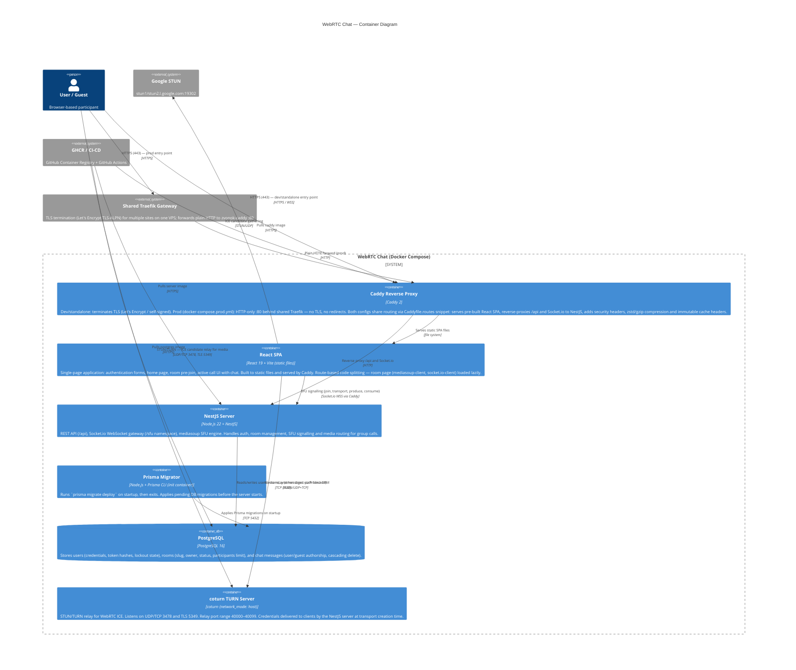

# C4 Level 2 — Container Diagram

> Развёртываемые единицы системы и их взаимодействие.



## Text Diagram

```
  [User / Guest]
       │
       │ HTTPS :443 → [Traefik] → Caddy :80 (prod); HTTPS :443 → Caddy (dev)
       │ TURN/UDP+TCP :3478, TLS :5349 (media relay)
       ▼
┌──────────────────────────────────────────────────────────────────┐
│                  Docker Compose Stack                            │
│                                                                  │
│  ┌──────────────────────────────────────────────────────────┐   │
│  │  Caddy (dev :443 TLS / prod :80 behind Traefik)         │   │
│  │  - Dev: TLS termination; prod: Traefik terminates       │   │
│  │  - Serves React SPA static files (/srv/client)           │   │
│  │  - Reverse proxy → NestJS (/api, Socket.io)              │   │
│  │  - zstd/gzip + immutable cache headers                   │   │
│  └──────────────────────────┬───────────────────────────────┘   │
│                              │ HTTP                              │
│                              ▼                                   │
│  ┌─────────────────────────────────────────────────────┐        │
│  │  NestJS Server :3000                                │        │
│  │  - REST API (/auth, /users, /rooms, /messages)         │        │
│  │  - Socket.io gateways (/sfu + chat)                   │        │
│  │  - mediasoup SFU engine (single Worker)              │        │
│  └────────────────────────────┬────────────────────────┘        │
│                               │ TCP :5432 (Prisma ORM)          │
│                               ▼                                  │
│  ┌───────────────────────┐   ┌──────────────────────────┐       │
│  │  PostgreSQL :5432     │   │  Prisma Migrator          │       │
│  │  users · rooms · messages │◄──│  (init container)         │       │
│  └───────────────────────┘   │  prisma migrate deploy    │       │
│                               └──────────────────────────┘       │
│                                                                  │
│  ┌──────────────────────────────────────────────────────────┐   │
│  │  coturn (network_mode: host)                             │   │
│  │  STUN/TURN :3478 (UDP+TCP) · TURNS :5349 (TLS)          │   │
│  │  relay range 40000–40099                                 │   │
│  └──────────────────────────────────────────────────────────┘   │
│                                                                  │
└──────────────────────────────────────────────────────────────────┘

  [Google STUN]          [GitHub GHCR]
  stun:*.google.com      ghcr.io/…/server
  ICE gathering          ghcr.io/…/client
  (STUN/UDP)             ghcr.io/…/migrator

Communication flow (client JS inside browser):
  Browser JS → Traefik → Caddy → NestJS  REST /* (prod; dev without Traefik)
  Browser JS → Traefik → Caddy → NestJS  Socket.io /sfu + chat
  Browser JS → coturn        (TURN)   media relay fallback
  Browser JS → Google STUN  (STUN)   ICE candidate gathering
  mediasoup  → RTP/SRTP/UDP           media via single Worker
```

## Container Responsibilities

| Container | Technology | Responsibility |
|-----------|-----------|----------------|
| **Caddy** | Caddy 2 | Dev: TLS termination, SPA serving, reverse proxy. Prod: HTTP-only behind shared Traefik |
| **React SPA** | React 19 + Vite | Client-side UI: auth, home, pre-join, active call, chat |
| **NestJS Server** | NestJS + Node 22 | REST API, Socket.io WebSocket, chat gateway, mediasoup SFU engine, global rate limiting |
| **Prisma Migrator** | Node + Prisma CLI | Init container — runs DB migrations, then exits |
| **PostgreSQL** | PostgreSQL 16 | Persistent storage: users, rooms, messages |
| **coturn** | coturn | STUN/TURN relay for WebRTC connectivity behind NAT |

## Communication Protocols

| From → To | Protocol | Purpose |
|-----------|----------|---------|
| Browser → Traefik → Caddy | HTTPS / HTTP | All web traffic (prod); dev goes direct to Caddy |
| Caddy → NestJS | HTTP | Reverse proxy |
| Client JS → NestJS | HTTP/JSON | REST API (auth, rooms, users) |
| Client JS → NestJS | Socket.io WSS | SFU signalling events |
| Client JS → coturn | TURN/UDP+TCP/TLS | Media relay (fallback) |
| Client JS → Google STUN | STUN/UDP | ICE gathering |
| NestJS → PostgreSQL | TCP (Prisma) | ORM queries |
| mediasoup workers | RTP/SRTP UDP | Internal media routing between workers |
