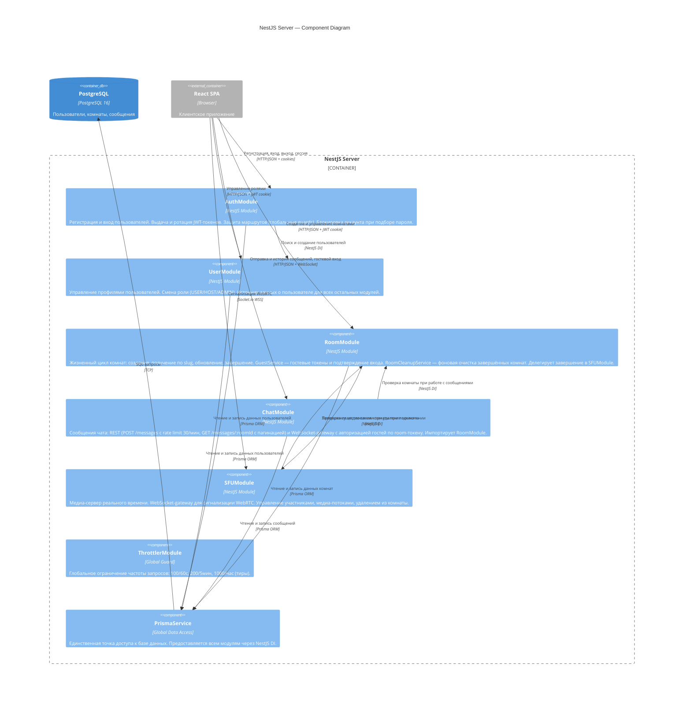

# C4 Level 3 — Backend Components (NestJS Server)

> Архитектурные модули NestJS-сервера и их бизнес-ответственность.

```mermaid
C4Component
    title NestJS Server — Component Diagram

    Container_Boundary(server, "NestJS Server") {

        Component(authModule, "AuthModule", "NestJS Module", "Регистрация и вход пользователей. Выдача и ротация JWT-токенов. Защита маршрутов (глобальные guards). Блокировка аккаунта при подборе пароля.")

        Component(userModule, "UserModule", "NestJS Module", "Управление профилями пользователей. Смена роли (USER/HOST/ADMIN). Источник данных о пользователе для всех остальных модулей.")

        Component(roomModule, "RoomModule", "NestJS Module", "Жизненный цикл комнат: создание, получение по slug, обновление, завершение. GuestService — гостевые токены и подтверждение входа. RoomCleanupService — фоновая очистка завершённых комнат. Делегирует завершение в SFUModule.")

        Component(chatModule, "ChatModule", "NestJS Module", "Сообщения чата: REST (POST /messages с rate limit 30/мин, GET /messages/:roomId с пагинацией) и WebSocket-gateway c авторизацией гостей по room-токену. Импортирует RoomModule.")

        Component(sfuModule, "SFUModule", "NestJS Module", "Медиа-сервер реального времени. WebSocket-gateway для сигнализации WebRTC. Управление участниками, медиа-потоками, удалением из комнаты.")

        Component(throttlerModule, "ThrottlerModule", "Global Guard", "Глобальное ограничение частоты запросов: 100/60с, 200/5мин, 1000/час (тиры).")

        Component(prismaService, "PrismaService", "Global Data Access", "Единственная точка доступа к базе данных. Предоставляется всем модулям через NestJS DI.")
    }

    ContainerDb(postgres, "PostgreSQL", "PostgreSQL 16", "Пользователи, комнаты, сообщения")
    Container_Ext(spa, "React SPA", "Browser", "Клиентское приложение")

    Rel(spa, authModule, "Регистрация, вход, выход, сессия", "HTTP/JSON + cookies")
    Rel(spa, userModule, "Управление ролями", "HTTP/JSON + JWT cookie")
    Rel(spa, roomModule, "Создание и управление комнатами", "HTTP/JSON + JWT cookie")
    Rel(spa, chatModule, "Отправка и история сообщений, гостевой вход", "HTTP/JSON + WebSocket")
    Rel(spa, sfuModule, "Сигнализация WebRTC", "Socket.io WSS")

    Rel(authModule, userModule, "Поиск и создание пользователей", "NestJS DI")
    Rel(chatModule, roomModule, "Проверка комнаты при работе с сообщениями", "NestJS DI")
    Rel(roomModule, sfuModule, "Завершение медиа-сессии при удалении комнаты", "NestJS DI")
    Rel(sfuModule, roomModule, "Проверка существования комнаты при подключении", "NestJS DI")

    Rel(authModule, prismaService, "Чтение и запись данных пользователей", "Prisma ORM")
    Rel(userModule, prismaService, "Чтение и запись данных пользователей", "Prisma ORM")
    Rel(roomModule, prismaService, "Чтение и запись данных комнат", "Prisma ORM")
    Rel(chatModule, prismaService, "Чтение и запись сообщений", "Prisma ORM")

    Rel(prismaService, postgres, "SQL-запросы", "TCP")
```
