# C4 Level 3 — Backend Components (NestJS Server)

> Внутренняя структура NestJS-сервера: модули, сервисы, контроллеры, gateway.

```mermaid
C4Component
    title NestJS Server — Component Diagram

    Container_Boundary(server, "NestJS Server") {

        %% ── AppModule ─────────────────────────────────────────
        Component(appModule, "AppModule", "NestJS Root Module", "Bootstrap module. Registers all feature modules globally. Configures CORS (CLIENT_URL + localhost:PORT), Cookie-Parser middleware, ValidationPipe (whitelist + forbidNonWhitelisted), global JwtAuthGuard and RolesGuard as APP_GUARD defaults. Configures Swagger at /swagger.")

        %% ── PrismaModule ──────────────────────────────────────
        Component(prismaService, "PrismaService", "NestJS @Global() Provider", "Wraps PrismaClient. Singleton injected across all modules. Manages DB connection lifecycle (onModuleInit / enableShutdownHooks).")

        %% ── AuthModule ────────────────────────────────────────
        Component(authController, "AuthController", "NestJS Controller — /auth", "REST endpoints: POST /register, POST /login, POST /refresh-token, POST /logout, GET /me. Sets / clears JWT cookies on response. @SkipAuthGuard on public endpoints. @Throttle on register (5/min) and login (10/min).")
        Component(authService, "AuthService", "NestJS Service", "Core auth logic: bcrypt registration, credential validation, JWT access + refresh token generation, refresh token rotation, reuse detection, account lockout after failed attempts.")
        Component(jwtStrategy, "JwtStrategy", "Passport Strategy", "Validates JWT access token from Authorization: Bearer header OR access_token cookie. Returns {id, email, role} to req.user.")
        Component(jwtRefreshStrategy, "JwtRefreshStrategy", "Passport Strategy", "Validates JWT refresh token from Authorization: Bearer header OR refresh_token cookie. Checks jti, tokenVersion, timing-safe hash comparison.")
        Component(jwtAuthGuard, "JwtAuthGuard", "NestJS Guard", "Global APP_GUARD default. Checks JWT access token. Skipped via @SkipAuthGuard() decorator.")
        Component(rolesGuard, "RolesGuard", "NestJS Guard", "Global APP_GUARD. Allows all if no @Roles() decorator. Checks user role if @Roles() present.")
        Component(throttlerModule, "ThrottlerModule", "NestJS Module", "Global rate limiting: short (10/60s), medium (20/5min), long (100/1hr). Per-endpoint overrides via @Throttle.")
        Component(skipAuthGuard, "SkipAuth Decorator", "Custom Decorator + Reflector", "Marks public endpoints. Causes JwtAuthGuard to allow unauthenticated requests through.")

        %% ── UserModule ────────────────────────────────────────
        Component(userController, "UserController", "NestJS Controller — /users", "REST endpoints: PATCH /:id/role (ADMIN only). Cannot change own role or demote last admin.")
        Component(userService, "UserService", "NestJS Service", "CRUD for User entity: findById, findByEmail, findByUsername, create, update. All queries via PrismaService.")

        %% ── RoomModule ────────────────────────────────────────
        Component(roomController, "RoomController", "NestJS Controller — /rooms", "REST endpoints: POST / (create room), GET /:slug (get by slug, public), PATCH /:id (update, owner only), DELETE /:id (end room + SFU shutdown, owner only). Owner check via JWT payload in controller.")
        Component(roomService, "RoomService", "NestJS Service", "Room lifecycle: create with random slug (6-char alphanumeric, retry-unique), find by slug/id, update, soft-delete (status=ended). Pure DB ops — no owner enforcement.")
        Component(roomCleanupService, "RoomCleanupService", "NestJS Service — background job", "Hourly interval job: hard-deletes rooms with status=ended and endedAt older than 1 hour. Implements OnModuleDestroy to clear the interval on shutdown.")

        %% ── SFUModule ─────────────────────────────────────────
        Component(sfuGateway, "SfuGateway", "Socket.io Gateway — /sfu namespace", "WebSocket event handlers for all sfu:* events. Authenticates connections via JWT cookie. Delegates to SfuService. Broadcasts new-producer and peer-left events to room peers.")
        Component(sfuService, "SfuService", "NestJS Service", "mediasoup orchestration: room creation per slug, peer registration, send/recv WebRtcTransport creation (with ICE server list), producer/consumer lifecycle, pause/resume, kick logic, room shutdown.")
        Component(workerManager, "WorkerManager", "NestJS Provider", "Manages a single mediasoup Worker process. Creates one Router per room. Handles Worker crashes with restart after 2-second delay.")
        Component(sfuConfig, "mediasoup.config.ts", "Config Provider", "Builds Worker settings, Router RTP capabilities (codecs: VP8, VP9, H264, opus), WebRtcTransport options (listenIps, maxIncoming/OutgoingBitrate), and getIceServers() list from TURN env vars.")
    }

    ContainerDb(postgres, "PostgreSQL", "PostgreSQL 16", "Users and rooms")
    Container_Ext(socketClient, "React SPA", "Browser", "Sends REST requests and Socket.io events")

    %% Relationships — REST
    Rel(socketClient, authController, "POST /auth/*, GET /auth/me", "HTTP/JSON + cookies")
    Rel(socketClient, userController, "PATCH /users/:id/role", "HTTP/JSON + JWT cookie")
    Rel(socketClient, roomController, "GET/POST/PATCH/DELETE /rooms/*", "HTTP/JSON + JWT cookie")

    %% Relationships — WebSocket
    Rel(socketClient, sfuGateway, "sfu:join / transport / produce / consume / resume / kick events", "Socket.io WSS")

    %% Auth internals
    Rel(authController, authService, "register, login, refresh, logout", "method call")
    Rel(authService, userService, "findByEmail, findByUsername, create, update", "method call")
    Rel(jwtStrategy, userService, "validate token id → user lookup", "method call")
    Rel(jwtRefreshStrategy, userService, "validate refresh token → user lookup", "method call")
    Rel(authController, jwtAuthGuard, "guarded by (global default)", "decorator")
    Rel(authController, skipAuthGuard, "@SkipAuthGuard on register/login/refresh-token", "decorator")

    %% User internals
    Rel(userController, userService, "CRUD operations", "method call")

    %% Room internals
    Rel(roomController, roomService, "CRUD operations", "method call")
    Rel(roomController, sfuService, "endRoom() on DELETE /:id", "method call")
    Rel(roomCleanupService, prismaService, "deleteMany ended rooms hourly", "Prisma ORM")

    %% SFU internals
    Rel(sfuGateway, sfuService, "delegates all sfu:* event handling", "method call")
    Rel(sfuService, workerManager, "getWorker() for new routers", "method call")
    Rel(sfuService, sfuConfig, "reads codec / transport / ICE config", "import")
    Rel(sfuGateway, roomService, "find room by slug at join", "method call")

    %% DB access
    Rel(authService, prismaService, "user read/write", "Prisma ORM")
    Rel(userService, prismaService, "user read/write", "Prisma ORM")
    Rel(roomService, prismaService, "room read/write", "Prisma ORM")

    %% AppModule wires everything
    Rel(appModule, prismaService, "imports PrismaModule (@Global)", "NestJS DI")
    Rel(appModule, authController, "imports AuthModule", "NestJS DI")
    Rel(appModule, userController, "imports UserModule", "NestJS DI")
    Rel(appModule, roomController, "imports RoomModule (imports SfuModule)", "NestJS DI")
    Rel(appModule, sfuGateway, "imports SFUModule", "NestJS DI")
```



## Text Diagram

```
  [React SPA]
      │
      ├── HTTP/JSON + cookies ──────────────────────────────────────┐
      │                                                             │
      │   ┌──────────────────────────────────────────────────────────────────────┐
      │   │  NestJS Server                                                       │
      │   │                                                                      │
      │   │  ┌─ AppModule (root) ─────────────────────────────────────────────┐ │
      │   │  │  Global JwtAuthGuard · RolesGuard · ThrottlerModule           │ │
      │   │  │  CORS · Cookie-Parser · ValidationPipe · Swagger               │ │
      │   │  └──┬──────────────┬──────────────┬──────────────┬────────────────┘ │
      │   │     │              │              │              │                  │
      │   │     ▼              ▼              ▼              ▼                  │
      │   │  ┌──────────┐ ┌──────────┐ ┌──────────┐ ┌──────────────────────┐  │
      │   │  │AuthModule│ │UserModule│ │RoomModule│ │     SFUModule        │  │
      │   │  │          │ │          │ │(imports  │ │                      │  │
      │   │  │Controller│ │Controller│ │SfuModule)│ │ SfuGateway (/sfu ns) │  │
      │   │  │/auth     │ │/users    │ │          │ │ SfuService           │  │
      │   │  │          │ │          │ │Controller│ │ WorkerManager        │  │
      │   │  │AuthService│ │UserService│ │/rooms   │ │ mediasoup.config.ts  │  │
      │   │  │          │ │          │ │          │ │                      │  │
      │   │  │Strategies│ │          │ │RoomService│ └──────────────────────┘  │
      │   │  │Jwt       │ │          │ │          │                            │
      │   │  │JwtRefresh│ │          │ │RoomCleanup│ ← hourly job              │
      │   │  │          │ │          │ │ Service  │                            │
      │   │  │JwtAuth   │ │          │ │          │                            │
      │   │  │Guard     │ │          │ │          │                            │
      │   │  │RolesGuard│ │          │ │          │                            │
      │   │  │Throttler │ │          │ │          │                            │
      │   │  └────┬─────┘ └────┬─────┘ └────┬─────┘                           │
      │   │       │            │            │                                  │
      │   │       └────────────┴────────────┴──────────────────────────────────┤
      │   │                          Prisma ORM                                │
      │   │                               │                                    │
      │   │  ┌─ PrismaService (@Global) ──┘                                   │
      │   │  └───────────────────────────────────────────────────────────────  │
      │   └──────────────────────────────────────────────────────────────────┘  │
      │                               │ TCP :5432                              │
      └──────────────────────►  [PostgreSQL]                                   │
                                                                                │
      ├── Socket.io WSS /sfu ───────────────────────────────────────────────── ┘
      │         ▲ sfu:* events
      └─────────┘

Key cross-module dependency:
  RoomController → SfuService.endRoom()  (on DELETE /rooms/:id)
  SfuGateway     → RoomService.findBySlug() (on sfu:join)
```

## Module Breakdown

### AuthModule (`apps/server/src/auth/`)

| Component | Type | Description |
|-----------|------|-------------|
| `AuthController` | Controller | `POST /auth/{register,login,refresh-token,logout}`, `GET /auth/me` |
| `AuthService` | Service | bcrypt hashing, JWT generation, token rotation, lockout |
| `JwtStrategy` | Passport Strategy | access token validation (Bearer header or cookie) |
| `JwtRefreshStrategy` | Passport Strategy | refresh token validation on `/refresh-token` |
| `JwtAuthGuard` | Guard | Global APP_GUARD default — skipped via `@SkipAuthGuard()` |
| `RolesGuard` | Guard | Global APP_GUARD — checks `@Roles()` decorator |
| `TokenHelper` | Helper | JWT access + refresh token generation |
| `PasswordHelper` | Helper | bcrypt hashing and verification |
| `RefreshTokenHelper` | Helper | SHA256 hashing and timing-safe comparison |
| `ThrottlerModule` | Rate Limiter | Global: 10/60s, 20/5min, 100/1hr; register 5/min, login 10/min |

### UserModule (`apps/server/src/user/`)

| Component | Type | Description |
|-----------|------|-------------|
| `UserController` | Controller | `PATCH /users/:id/role` (ADMIN only) |
| `UserService` | Service | CRUD: findById, findByEmail, findByUsername, create, update |

### RoomModule (`apps/server/src/room/`)

| Component | Type | Description |
|-----------|------|-------------|
| `RoomController` | Controller | `POST /rooms`, `GET /rooms/:slug`, `PATCH/DELETE /rooms/:id` |
| `RoomService` | Service | Room lifecycle: create/find/update/soft-delete; slug generation; pure DB ops |
| `RoomCleanupService` | Background Service | Hourly job — hard-deletes ended rooms older than 1h |

### SFUModule (`apps/server/src/sfu/`)

| Component | Type | Description |
|-----------|------|-------------|
| `SfuGateway` | WebSocket Gateway | `/sfu` namespace — all `sfu:*` event handlers |
| `SfuService` | Service | mediasoup orchestration: rooms, peers, transports, producers, consumers |
| `WorkerManager` | Provider | Single Worker, per-room Routers, crash recovery (2s restart delay) |
| `mediasoup.config.ts` | Config | Codecs, transport options, `getIceServers()` (TURN env vars) |

### PrismaModule (`apps/server/src/prisma/`)

| Component | Type | Description |
|-----------|------|-------------|
| `PrismaService` | Global Service | `@Global()` — single PrismaClient injected everywhere |

## REST API Summary

| Method | Path | Auth | Handler |
|--------|------|------|---------|
| `POST` | `/auth/register` | Public (`@SkipAuthGuard`) | `AuthController.register` → 201 Created |
| `POST` | `/auth/login` | Public (`@SkipAuthGuard`) | `AuthController.login` → 200 OK |
| `POST` | `/auth/refresh-token` | JwtRefreshGuard | `AuthController.refresh` → 200 OK |
| `POST` | `/auth/logout` | Protected (default) | `AuthController.logout` → 200 OK |
| `GET` | `/auth/me` | Protected (default) | `AuthController.getMe` → 200 OK |
| `PATCH` | `/users/:id/role` | ADMIN only (`@Roles(Role.ADMIN)`) | `UserController.updateRole` → 200 OK |
| `POST` | `/rooms` | HOST or ADMIN (`@Roles`) | `RoomController.create` → 201 Created |
| `GET` | `/rooms/:slug` | Public (`@SkipAuthGuard`) | `RoomController.getBySlug` → 200 OK |
| `PATCH` | `/rooms/:id` | Protected (owner check in controller) | `RoomController.update` → 200 OK |
| `DELETE` | `/rooms/:id` | Protected (owner check in controller) | `RoomController.end` → 204 No Content + `SfuService.endRoom` |

## Swagger / OpenAPI

Available at `/swagger` (UI) and `/swagger/json` (raw spec). Configured in `bootstrap.ts`.
