# C4 Level 3 — Frontend Components (React SPA)

> Внутренняя структура React-приложения: фичи, хуки, библиотеки, маршруты.

```mermaid
C4Component
    title React SPA — Component Diagram

    Container_Boundary(spa, "React SPA (apps/client/src/)") {

        %% ── Routing ──────────────────────────────────────────
        Component(router, "React Router v7", "App-level routing", "Defines 4 routes: / (Home), /login, /register, /room/:slug. Wraps the app with AuthProvider and QueryClientProvider. Room route is lazy-loaded (React.lazy) to split mediasoup-client and socket.io-client into a separate chunk.")

        %% ── Features / Auth ──────────────────────────────────
        Component(authContext, "AuthContext / AuthProvider", "React Context + useAuth() hook", "Global auth state: current user, isLoading, login(), logout(), register() helpers. Fetches /auth/me on mount to rehydrate session. Consumed everywhere via useAuth().")
        Component(authForms, "LoginPage / RegisterPage", "React Route Components", "Form-based UIs built with React Hook Form + Zod validation. Call authApi on submit. Redirect away if already authenticated.")
        Component(authService, "authApi (auth service)", "Feature service", "Typed wrappers around ApiClient for auth endpoints: register, login, logout, getCurrentUser.")

        %% ── Features / Room ──────────────────────────────────
        Component(roomPage, "RoomPage", "Lazy React Route Component", "Canonical room entry point at /room/:slug. Switches between three states: PreJoinView, ActiveRoomView, EndedView. Manages the join flow and SFU connection lifecycle via useRoomSession orchestrator hook.")
        Component(preJoinView, "PreJoinView", "React Component", "Device setup before joining: camera/mic preview, device selector, enable/disable toggles, display name input, shareable invite link. Passes selected deviceIds + enabled state to the room join handler.")
        Component(activeCallView, "ActiveRoomView", "React Component", "Active call UI: local + remote video tiles (VideoGrid + @zvonok/video-layout), mute/camera controls, leave/end-room buttons, participant list sidebar. Reads SFU peer state from SfuManager context.")
        Component(roomService, "roomApi (room service)", "Feature service", "Typed wrappers around ApiClient for room CRUD: create, getBySlug, update, end.")
        Component(roomHooks, "useRoom / useCreateRoom / useEndRoom hooks", "TanStack Query hooks", "Data-fetching hooks for room operations. Cache invalidation on create/update/delete.")
        Component(roomSession, "useRoomSession", "Orchestrator hook", "Composes useRoomSfu, useRemoteAudio, useActiveSpeaker, useQualityStats, useRoomParticipants for the active call state.")

        %% ── Features / Media ─────────────────────────────────
        Component(mediaManagerCtx, "MediaManagerProvider", "React Context + hooks", "Owns the local MediaStream lifecycle via MediaStreamManager (video + audio capture). Exposes useVideoCaptureControl, useAudioCaptureControl, useCaptureTrackProvider, useDeviceService hooks.")
        Component(mediaStreamCtx, "MediaStreamProvider", "React Context", "Convenience wrapper that auto-starts video+audio on mount. Exposes videoStream/audioStream and states.")
        Component(deviceSelector, "DeviceSelector", "React Component", "Prejoin device picker: local video preview, mic/camera toggles, speaker dropdown, permission modal.")
        Component(mediaControls, "MediaControls", "React Component", "In-call toolbar: video/audio toggle buttons with state icons + participants toggle.")
        Component(deviceHooks, "useMediaDevices / useDeviceSwitching / useSfuTrackSync", "Hooks", "Device enumeration, selection (persisted to localStorage), device switching with SFU producer track sync.")

        %% ── Features / SFU ───────────────────────────────────
        Component(sfuContext, "SfuProvider / useSfuManager()", "React Context + hook", "Wraps SfuManager lifecycle via DI. Exposes ISfuManager interface for join/leave/produce/consume operations.")

        %% ── Lib / API ────────────────────────────────────────
        Component(apiClient, "ApiClient", "lib/api/api-client.ts", "Thin fetch wrapper: base URL from VITE_API_BASE_URL, credentials: include (sends cookies), automatic POST /auth/refresh-token on 401 (one retry, concurrent-refresh dedup), throws typed ApiError / AuthError / ValidationError / NetworkError.")

        %% ── Lib / SFU ────────────────────────────────────────
        Component(sfuManager, "SfuManager", "lib/sfu/manager.ts", "Orchestrates the full mediasoup-client flow: socket.io connect, sfu:join, transport creation (send + recv), produce (video + audio), consume remote peers, resume consumers, peer lifecycle. Implements ISfuManager facade.")
        Component(sfuConnection, "SfuConnection", "lib/sfu/connection.ts", "Manages socket.io connection to the /sfu namespace. Handles reconnection (10 attempts, 1-5s delay), auth cookie forwarding, and event routing to EventRouter.")
        Component(eventRouter, "EventRouter", "lib/sfu/event-router.ts", "Routes incoming sfu:* socket events (14 events) to registered handlers. Decouples SfuManager from socket.io internals.")
        Component(statsCollector, "StatsCollector", "lib/sfu/stats-collector.ts", "Polls RTCPeerConnection.getStats() at 2s interval. Emits bitrate, packetLoss, jitter, RTT metrics per peer.")
        Component(qualityScore, "qualityScore", "lib/sfu/quality-score.ts", "Computes a 0–100 quality score from StatsCollector metrics for the network quality indicator.")

        %% ── Lib / Media ──────────────────────────────────────
        Component(mediaManager, "MediaStreamManager", "lib/media/manager.ts", "Composes video + audio MediaCapture instances. State machine: STOPPED → STARTING → ACTIVE with request dedup, auto-retry on NotReadableError.")
        Component(mediaCapture, "MediaCapture", "lib/media/capture.ts", "State machine for media capture: request dedup, auto-retry on NotReadableError, track ended detection.")
        Component(deviceService, "MediaDeviceService", "lib/media/device-service.ts", "Wraps navigator.mediaDevices.getUserMedia/enumerateDevices/permissions.query.")
        Component(errorClassifier, "DefaultErrorClassifier", "lib/media/error-classifier.ts", "Maps DOMExceptions to CaptureState: NotAllowed → SYSTEM_DENIED, NotFound → DEVICE_NOT_FOUND, etc.")

        %% ── Lib / Audio ──────────────────────────────────────
        Component(remoteAudioMixer, "RemoteAudioMixer", "lib/audio/remote-audio-mixer.ts", "Web Audio API graph: per-peer source → gain → analyser → destination → audioElement. Supports addPeer, removePeer, updatePeerTrack, setSink, setGain.")

        %% ── UI Components ────────────────────────────────────
        Component(uiComponents, "UI Primitives", "components/ui/ (@base-ui/react)", "Headless accessible components: Button, Input, Card, Label, Dialog, DropdownMenu, Tooltip, Separator, Alert. Styled with Tailwind CSS v4 + CVA.")
        Component(homePage, "HomePage", "React Route Component", "Landing page: create room dialog, join by slug input. Uses roomHooks + authContext. Auth-aware navigation via AuthHeader.")
    }

    Container_Ext(nestServer, "NestJS Server", "Server", "REST API + Socket.io /sfu gateway")
    System_Ext(browserApi, "Browser WebRTC / Media API", "Native Browser APIs", "getUserMedia, RTCPeerConnection, getStats")

    %% User interactions
    Rel(router, authContext, "wraps entire app", "React tree")
    Rel(router, homePage, "/ route", "eager")
    Rel(router, authForms, "/login /register routes", "eager")
    Rel(router, roomPage, "/room/:slug route", "React.lazy")

    %% Auth flow
    Rel(authContext, authService, "login / register / logout / getCurrentUser", "method call")
    Rel(authService, apiClient, "HTTP requests", "fetch")
    Rel(authForms, authContext, "useAuth()", "hook")

    %% Room flow
    Rel(homePage, roomHooks, "useRoom / useCreateRoom", "hook")
    Rel(roomHooks, roomService, "CRUD calls", "method call")
    Rel(roomService, apiClient, "HTTP requests", "fetch")
    Rel(roomPage, roomService, "getBySlug", "method call")
    Rel(roomPage, preJoinView, "renders in pre-join state", "React")
    Rel(roomPage, activeCallView, "renders in active state", "React")
    Rel(roomPage, sfuContext, "SfuProvider wraps room", "React tree")

    %% Media flow
    Rel(preJoinView, mediaManagerCtx, "useMediaStream()", "hook")
    Rel(mediaManagerCtx, mediaManager, "acquire / stop stream", "method call")
    Rel(mediaManager, mediaCapture, "getUserMedia", "method call")
    Rel(mediaCapture, browserApi, "navigator.mediaDevices", "Browser API")
    Rel(preJoinView, deviceSelector, "renders DeviceSelector", "React")
    Rel(deviceHooks, mediaCapture, "switchDevice", "method call")

    %% SFU flow
    Rel(activeCallView, sfuContext, "useSfuManager() — peers, state, controls", "hook")
    Rel(sfuContext, sfuManager, "join / leave / produce / consume", "method call")
    Rel(sfuManager, sfuConnection, "socket events", "method call")
    Rel(sfuManager, eventRouter, "registers event handlers", "method call")
    Rel(sfuManager, statsCollector, "start / stop polling", "method call")
    Rel(statsCollector, qualityScore, "compute score", "function call")
    Rel(sfuConnection, nestServer, "Socket.io WSS /sfu", "WebSocket")
    Rel(sfuManager, browserApi, "RTCPeerConnection via mediasoup-client", "Browser API")

    %% API
    Rel(apiClient, nestServer, "REST /*", "HTTP/JSON + cookies")

    %% UI
    Rel(homePage, uiComponents, "Button, Card, Dialog, Input", "React")
    Rel(activeCallView, uiComponents, "Button, DropdownMenu, Tooltip", "React")
    Rel(authForms, uiComponents, "Input, Button, Card, Label", "React")
```



## Text Diagram

```
  Browser
  ├── [React Router v7]
  │    ├── /            → HomePage (eager)
  │    ├── /login       → LoginPage (eager)
  │    ├── /register    → RegisterPage (eager)
  │    └── /room/:slug  → RoomPage (lazy — separate chunk)
  │
  ├── [AuthProvider]  ← wraps entire app tree
  │    ├── AuthContext / useAuth()
  │    ├── authApi (service)
  │    └── ApiClient ──────────────────────────► NestJS REST /*
  │                                               (credentials:include, 401→auto-refresh)
  │
  ├── [HomePage]
  │    ├── useCreateRoom, useRoom (TanStack Query)
  │    └── roomApi (service) → ApiClient
  │
  ├── [LoginPage / RegisterPage]
  │    └── React Hook Form + Zod → authApi
  │
  └── [RoomPage]  ← lazy loaded
       │
       ├── [PreJoinView]
       │    ├── MediaStreamProvider / MediaManagerProvider
       │    │    └── MediaStreamManager
       │    │         ├── MediaCapture → navigator.mediaDevices (Browser API)
       │    │         ├── MediaDeviceService (device listing)
       │    │         └── DefaultErrorClassifier
       │    └── DeviceSelector / DeviceControlGroup
       │
       ├── [ActiveRoomView]
       │    ├── VideoGrid + VideoTile (@zvonok/video-layout)
       │    ├── LocalVideo / RemoteVideo / RemoteAudio
       │    ├── ParticipantsList / ParticipantItem / QualityIndicator
       │    ├── MediaControls (toolbar)
       │    └── useRoomSession (orchestrator)
       │         ├── useRoomSfu → SfuProvider / useSfuManager()
       │         │    └── SfuManager
       │         │         ├── SfuConnection → Socket.io WSS /sfu → NestJS
       │         │         ├── EventRouter (14 sfu:* events)
       │         │         ├── mediasoup-client Device → RTCPeerConnection
       │         │         └── StatsCollector → qualityScore (0–100)
       │         ├── useRemoteAudio → RemoteAudioMixer (Web Audio API)
       │         ├── useActiveSpeaker (audio analyser)
       │         ├── useQualityStats
       │         └── useRoomParticipants
       │
       └── [CallEndedView]

  Shared:
  ┌─────────────────────────────────────────────────────┐
  │  components/ui/ (@base-ui/react + Tailwind v4)      │
  │  Button · Input · Card · Label · Dialog · Tooltip   │
  │  DropdownMenu · Separator · Alert · Sonner          │
  │  CopyLink · LinkButton · ThemeSwitcher              │
  └─────────────────────────────────────────────────────┘

  Bundle chunks (gzip):
  vendor-react  ~45 KB  │  React + Router (eager)
  vendor-data   ~30 KB  │  TanStack Query + RHF + Zod (eager)
  app           ~97 KB  │  App code (eager)
  vendor-sfu    ~73 KB  │  mediasoup-client + socket.io (lazy, room only)
```

## Feature Breakdown

### `features/auth/`

| Component | Description |
|-----------|-------------|
| `AuthContext` / `AuthProvider` | Global session state — `useAuth()` hook consumed everywhere |
| `LoginPage` / `RegisterPage` | Form UI with React Hook Form + Zod validation |
| `ProfileDropdown` | User info + logout dropdown |
| `AuthHeader` | Top nav bar with logo, theme switcher, login/profile |
| `authApi` | Typed API wrappers for auth endpoints |

### `features/room/`

| Component | Description |
|-----------|-------------|
| `RoomPage` | Lazy route — orchestrates pre-join / active / ended states |
| `RoomView` | Active room shell — header + alerts + ActiveRoomView |
| `PreJoinView` | Device setup UI with preview before joining call |
| `ActiveRoomView` | In-call UI: video grid, controls, participant list sidebar |
| `CallEndedView` | Room ended screen with link back to home |
| `RoomHeader` | Dual-variant header (prejoin vs active) |
| `ConnectionStatus` | WiFi/WifiOff icon + connection state label |
| `RoomAlerts` | Error banners for end-room failure and kick |
| `roomApi` | Typed API wrappers for room CRUD |
| `useRoom` / `useCreateRoom` / `useEndRoom` | TanStack Query hooks |
| `useRoomSession` | Orchestrator composing SFU, audio, speaker, stats, participants |
| `useRoomSfu` | Bridges media controls ↔ SFU produce/pause/resume |
| `useActiveSpeaker` | Audio analyser-based active speaker detection |
| `useRoomParticipants` | Merges local + remote peers into Participant[] |

### `features/media/`

| Component | Description |
|-----------|-------------|
| `MediaManagerProvider` | Context — MediaStreamManager lifecycle, capture controls |
| `MediaStreamProvider` | Context — auto-starts video+audio on mount |
| `MediaControls` | In-call toolbar — video/audio toggle buttons |
| `DeviceSelector` | Prejoin device picker with preview |
| `DeviceControlGroup` | Toggle button + device dropdown |
| `DeviceSettingsPanel` | In-call device settings popover |
| `PermissionRequestModal` | Dialog for denied camera/mic permissions |
| `SingleDeviceSelector` | Single device dropdown |
| `SpeakerDeviceControlGroup` | Speaker-only dropdown |
| `ActiveDeviceDisplay` | Shows active device names |
| `useMediaControls` | Tracks isVideoEnabled/isAudioEnabled |
| `useMediaDevices` | Device enumeration + selected IDs (localStorage) |
| `useDeviceSwitching` | switchVideoDevice/switchAudioDevice/switchSpeakerDevice |
| `useSfuTrackSync` | Auto-replaces SFU producer tracks on device switch |

### `features/sfu/`

| Component | Description |
|-----------|-------------|
| `SfuProvider` / `useSfuManager()` | Context wrapping SfuManager via DI — ISfuManager facade |

### `lib/api/`

| Component | Description |
|-----------|-------------|
| `ApiClient` | Fetch wrapper with cookie credentials, 401-auto-refresh (concurrent dedup), typed errors |
| `api.errors.ts` | `ApiError`, `AuthError`, `ValidationError`, `NetworkError` |

### `lib/sfu/`

| Component | Description |
|-----------|-------------|
| `SfuManager` | Full mediasoup-client orchestration (transport, producer, consumer) — ISfuManager facade |
| `SfuConnection` | socket.io connection to `/sfu` namespace (reconnection: 10 attempts, 1-5s) |
| `EventRouter` | Decoupled routing of 14 `sfu:*` events |
| `StatsCollector` | Periodic `getStats()` polling (2s interval) for quality metrics |
| `qualityScore` | 0–100 quality score from RTC stats |
| `interfaces.ts` | ISfuManager, ISfuConnection, ISfuRoomMembership, ISfuProducerManager, etc. |
| `types.ts` | All SFU payload types |

### `lib/media/`

| Component | Description |
|-----------|-------------|
| `MediaStreamManager` | Composes video + audio MediaCapture instances |
| `MediaCapture` | State machine: STOPPED→STARTING→ACTIVE, request dedup, auto-retry |
| `CaptureState` | 10 states enum + helper functions |
| `MediaDeviceService` | `getUserMedia` / `enumerateDevices` / `permissions.query` |
| `DefaultErrorClassifier` | Maps DOMExceptions to CaptureState |
| `ManagerFactory` | Factory with optional DI for deviceService/errorClassifier |

### `lib/audio/`

| Component | Description |
|-----------|-------------|
| `RemoteAudioMixer` | Web Audio API graph: per-peer source→gain→analyser→destination |

### `lib/config/`

| Component | Description |
|-----------|-------------|
| `app.ts` | `APP_NAME = 'ZvonOK'` |
| `routes.ts` | Route constants + `getRoomRoute(slug)` |
| `media.ts` | Default video/audio constraints |
| `themes.ts` | 4 color themes + light/dark mode |

## Route Summary

| Route | Component | Auth Required | Lazy |
|-------|-----------|---------------|------|
| `/` | `HomePage` | No | No |
| `/login` | `LoginPage` | No (redirect if authed) | No |
| `/register` | `RegisterPage` | No (redirect if authed) | No |
| `/room/:slug` | `RoomPage` | Optional | **Yes** |

## Build Optimization (Bundle Chunks)

| Chunk | Contents | Approx Size (gzip) |
|-------|----------|--------------------|
| `vendor-react` | React, React-DOM, React Router | ~45 KB |
| `vendor-data` | TanStack Query, react-hook-form, zod | ~30 KB |
| `app` | Application code (all non-room) | ~97 KB |
| `vendor-sfu` *(lazy)* | mediasoup-client, socket.io-client | ~73 KB |
