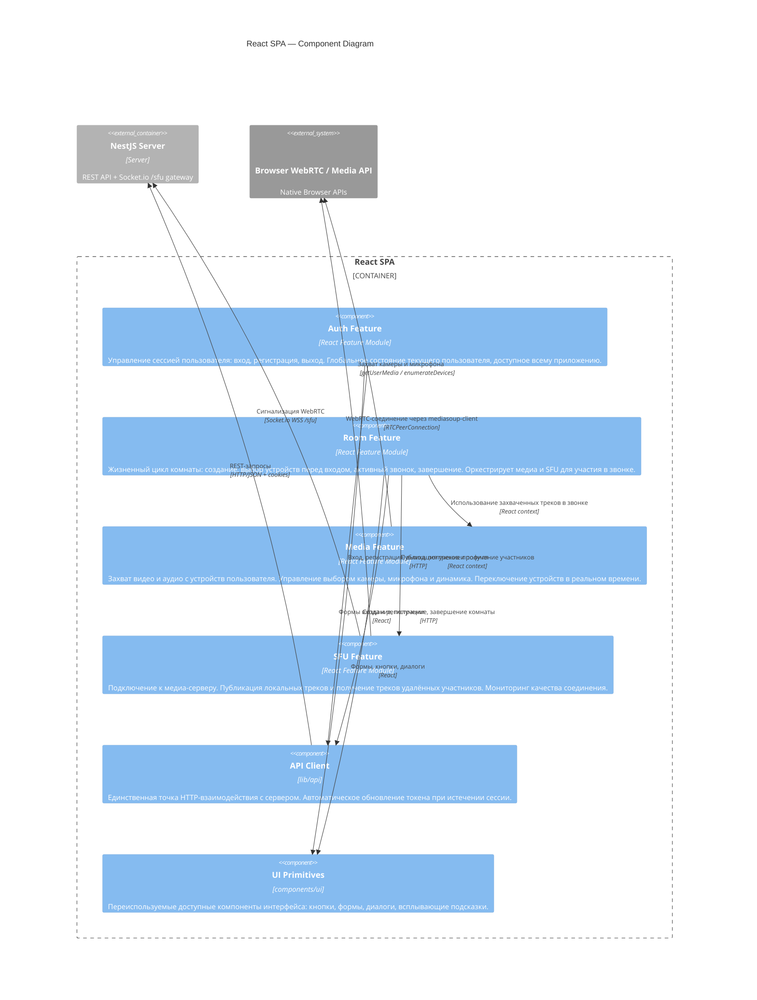

# C4 Level 3 — Frontend Components (React SPA)

> Архитектурные слои React-приложения и их бизнес-ответственность.

```mermaid
C4Component
    title React SPA — Component Diagram

    Container_Boundary(spa, "React SPA") {

        Component(authFeature, "Auth Feature", "React Feature Module", "Управление сессией пользователя: вход, регистрация, выход. Глобальное состояние текущего пользователя, доступное всему приложению.")

        Component(roomFeature, "Room Feature", "React Feature Module", "Жизненный цикл комнаты: создание, выбор устройств перед входом, активный звонок, завершение. Оркестрирует медиа и SFU для участия в звонке.")

        Component(mediaFeature, "Media Feature", "React Feature Module", "Захват видео и аудио с устройств пользователя. Управление выбором камеры, микрофона и динамика. Переключение устройств в реальном времени.")

        Component(sfuFeature, "SFU Feature", "React Feature Module", "Подключение к медиа-серверу. Публикация локальных треков и получение треков удалённых участников. Мониторинг качества соединения.")

        Component(apiClient, "API Client", "lib/api", "Единственная точка HTTP-взаимодействия с сервером. Автоматическое обновление токена при истечении сессии.")

        Component(uiPrimitives, "UI Primitives", "components/ui", "Переиспользуемые доступные компоненты интерфейса: кнопки, формы, диалоги, всплывающие подсказки.")
    }

    Container_Ext(nestServer, "NestJS Server", "Server", "REST API + Socket.io /sfu gateway")
    System_Ext(browserApi, "Browser WebRTC / Media API", "Native Browser APIs", "Захват медиа и WebRTC-соединение")

    Rel(authFeature, apiClient, "Вход, регистрация, выход, получение профиля", "HTTP")
    Rel(roomFeature, apiClient, "Создание, получение, завершение комнаты", "HTTP")
    Rel(roomFeature, mediaFeature, "Использование захваченных треков в звонке", "React context")
    Rel(roomFeature, sfuFeature, "Публикация треков и получение участников", "React context")
    Rel(roomFeature, uiPrimitives, "Формы, кнопки, диалоги", "React")
    Rel(authFeature, uiPrimitives, "Формы входа и регистрации", "React")

    Rel(mediaFeature, browserApi, "Захват камеры и микрофона", "getUserMedia / enumerateDevices")
    Rel(sfuFeature, browserApi, "WebRTC-соединение через mediasoup-client", "RTCPeerConnection")
    Rel(sfuFeature, nestServer, "Сигнализация WebRTC", "Socket.io WSS /sfu")
    Rel(apiClient, nestServer, "REST-запросы", "HTTP/JSON + cookies")
```
