# C4 Level 3 — Frontend Components (React SPA)

> Внутренняя структура React-приложения: фичи, хуки, библиотеки, маршруты.

```mermaid
C4Component
    title React SPA — Component Diagram

    Container_Boundary(spa, "React SPA (apps/client/src/)") {

        %% ── Routing ──────────────────────────────────────────
        Component(router, "React Router v7", "File-based routing", "Defines 4 routes: / (Home), /login, /register, /room/:slug. Wraps the app with AuthProvider and QueryClientProvider. Room route is lazy-loaded (React.lazy) to split mediasoup-client and socket.io-client into a separate chunk.")

        %% ── Features / Auth ──────────────────────────────────
        Component(authContext, "AuthContext / AuthProvider", "React Context + useAuth() hook", "Global auth state: current user, isLoading, login(), logout(), register() helpers. Fetches /api/users/me on mount to rehydrate session. Consumed everywhere via useAuth().")
        Component(authForms, "LoginPage / RegisterPage", "React Route Components", "Form-based UIs built with React Hook Form + Zod validation. Call authApi on submit. Redirect away if already authenticated.")
        Component(authService, "authApi (auth service)", "Feature service", "Typed wrappers around ApiClient for auth endpoints: register, login, logout, getMe.")

        %% ── Features / Room ──────────────────────────────────
        Component(roomPage, "RoomPage", "Lazy React Route Component", "Canonical room entry point at /room/:slug. Switches between three states: PreJoinView, ActiveCallView, EndedView. Manages the join flow and SFU connection lifecycle.")
        Component(preJoinView, "PreJoinView", "React Component", "Device setup before joining: camera/mic preview, device selector, enable/disable toggles, shareable invite link. Passes selected deviceIds + enabled state to the room join handler.")
        Component(activeCallView, "ActiveCallView", "React Component", "Active call UI: local + remote video tiles, mute/camera controls, leave/end-room buttons, participant list. Reads SFU peer state from SfuContext.")
        Component(roomService, "roomApi (room service)", "Feature service", "Typed wrappers around ApiClient for room CRUD: list, create, getBySlug, update, end.")
        Component(roomHooks, "useRoom / useRooms hooks", "TanStack Query hooks", "Data-fetching hooks for room operations. Cache invalidation on create/update/delete.")

        %% ── Features / Media ─────────────────────────────────
        Component(mediaStreamCtx, "MediaStreamProvider / useMediaStream()", "React Context + hook", "Owns the local MediaStream lifecycle. On mount, reads saved deviceIds from localStorage and calls getUserMedia. Exposes stream, audioEnabled, videoEnabled and toggle functions.")
        Component(mediaTrackCtrl, "MediaTrackController", "lib/media singleton", "Low-level track manager: acquire streams, switch devices (replaceTrack), pause/resume, fallback track on error. Persists device selections to localStorage.")
        Component(deviceSwitcher, "DeviceSwitcher / useMediaDevices()", "Component + hook", "Lists available cameras/mics/speakers. Calls MediaTrackController.switchDevice on selection change.")

        %% ── Features / SFU ───────────────────────────────────
        Component(sfuContext, "SfuProvider / useSfu()", "React Context + hook", "Wraps SfuManager lifecycle. Exposes peers map, localProducerIds, connectionState, and imperative join()/leave() helpers consumed by ActiveCallView.")

        %% ── Lib / API ────────────────────────────────────────
        Component(apiClient, "ApiClient", "lib/api/api-client.ts", "Thin fetch wrapper: base URL from VITE_API_BASE_URL, credentials: include (sends cookies), automatic POST /api/auth/refresh on 401 (one retry), throws typed ApiError / AuthError / ValidationError / NetworkError.")

        %% ── Lib / SFU ────────────────────────────────────────
        Component(sfuManager, "SfuManager", "lib/sfu/manager.ts", "Orchestrates the full mediasoup-client flow: socket.io connect, sfu:join, transport creation (send + recv), produce (video + audio), consume remote peers, resume consumers, peer lifecycle (new-producer / peer-left events). Uses mediasoup-client Device.")
        Component(sfuConnection, "SfuConnection", "lib/sfu/connection.ts", "Manages socket.io connection to the /sfu namespace. Handles reconnection, auth cookie forwarding, and event routing to EventRouter.")
        Component(eventRouter, "EventRouter", "lib/sfu/event-router.ts", "Routes incoming sfu:* socket events to registered handlers. Decouples SfuManager from socket.io internals.")
        Component(statsCollector, "StatsCollector", "lib/sfu/stats-collector.ts", "Polls RTCPeerConnection.getStats() at configurable interval. Emits bitrate, packetLoss, jitter, RTT metrics. Used for quality indicator UI.")
        Component(qualityScore, "qualityScore", "lib/sfu/quality-score.ts", "Computes a 0–100 quality score from StatsCollector metrics for the network quality indicator.")

        %% ── Lib / Media ──────────────────────────────────────
        Component(mediaManager, "MediaManager", "lib/media/manager.ts", "Coordinates MediaAcquisition, MediaTrackController, and DeviceSwitcher. Singleton providing the unified media API used by MediaStreamProvider.")
        Component(mediaAcquisition, "MediaAcquisition", "lib/media/acquisition.ts", "Calls navigator.mediaDevices.getUserMedia / getDisplayMedia. Handles permission errors and device not found errors. Returns typed result.")
        Component(permissions, "permissions.ts", "lib/media", "Checks and requests camera/mic permissions. Wraps navigator.permissions API.")

        %% ── UI Components ────────────────────────────────────
        Component(uiComponents, "UI Primitives", "components/ui/ (Radix UI)", "Headless accessible components: Button, Input, Card, Label, Dialog, DropdownMenu, Select. Styled with Tailwind CSS v4.")
        Component(homePage, "HomePage", "React Route Component", "Authenticated landing page: create room dialog, join by slug input, list of user's rooms. Uses roomHooks + authContext.")
    }

    Container_Ext(nestServer, "NestJS Server", "Server", "REST API + Socket.io /sfu gateway")
    System_Ext(browserApi, "Browser WebRTC / Media API", "Native Browser APIs", "getUserMedia, RTCPeerConnection, getStats")

    %% User interactions
    Rel(router, authContext, "wraps entire app", "React tree")
    Rel(router, homePage, "/ route", "React.lazy / eager")
    Rel(router, authForms, "/login /register routes", "eager")
    Rel(router, roomPage, "/room/:slug route", "React.lazy")

    %% Auth flow
    Rel(authContext, authService, "login / register / logout / getMe", "method call")
    Rel(authService, apiClient, "HTTP requests", "fetch")
    Rel(authForms, authContext, "useAuth()", "hook")

    %% Room flow
    Rel(homePage, roomHooks, "useRooms / create / join", "hook")
    Rel(roomHooks, roomService, "CRUD calls", "method call")
    Rel(roomService, apiClient, "HTTP requests", "fetch")
    Rel(roomPage, roomService, "getBySlug", "method call")
    Rel(roomPage, preJoinView, "renders in pre-join state", "React")
    Rel(roomPage, activeCallView, "renders in active state", "React")
    Rel(roomPage, sfuContext, "SfuProvider wraps room", "React tree")

    %% Media flow
    Rel(preJoinView, mediaStreamCtx, "useMediaStream()", "hook")
    Rel(mediaStreamCtx, mediaManager, "acquire / stop stream", "method call")
    Rel(mediaManager, mediaTrackCtrl, "track lifecycle", "method call")
    Rel(mediaManager, mediaAcquisition, "getUserMedia", "method call")
    Rel(mediaAcquisition, browserApi, "navigator.mediaDevices", "Browser API")
    Rel(preJoinView, deviceSwitcher, "renders DeviceSwitcher", "React")
    Rel(deviceSwitcher, mediaTrackCtrl, "switchDevice", "method call")

    %% SFU flow
    Rel(activeCallView, sfuContext, "useSfu() — peers, state, controls", "hook")
    Rel(sfuContext, sfuManager, "join / leave / produce / consume", "method call")
    Rel(sfuManager, sfuConnection, "socket events", "method call")
    Rel(sfuManager, eventRouter, "registers event handlers", "method call")
    Rel(sfuManager, statsCollector, "start / stop polling", "method call")
    Rel(statsCollector, qualityScore, "compute score", "function call")
    Rel(sfuConnection, nestServer, "Socket.io WSS /sfu", "WebSocket")
    Rel(sfuManager, browserApi, "RTCPeerConnection via mediasoup-client", "Browser API")

    %% API
    Rel(apiClient, nestServer, "REST /api/*", "HTTP/JSON + cookies")

    %% UI
    Rel(homePage, uiComponents, "Button, Card, Dialog, Input", "React")
    Rel(preJoinView, uiComponents, "Button, Select", "React")
    Rel(activeCallView, uiComponents, "Button, DropdownMenu", "React")
    Rel(authForms, uiComponents, "Input, Button, Card, Label", "React")
```



## Text Diagram

```
  Browser
  ├── [React Router v7]
  │    ├── /            → HomePage (eager)
  │    ├── /login       → LoginPage (eager)
  │    ├── /register    → RegisterPage (eager)
  │    └── /room/:slug  → RoomPage (lazy — separate chunk)
  │
  ├── [AuthProvider]  ← wraps entire app tree
  │    ├── AuthContext / useAuth()
  │    ├── authApi (service)
  │    └── ApiClient ──────────────────────────► NestJS REST /api/*
  │                                               (credentials:include, 401→auto-refresh)
  │
  ├── [HomePage]
  │    ├── useRooms / useRoom (TanStack Query)
  │    └── roomApi (service) → ApiClient
  │
  ├── [LoginPage / RegisterPage]
  │    └── React Hook Form + Zod → authApi
  │
  └── [RoomPage]  ← lazy loaded
       │
       ├── PreJoinView
       │    ├── MediaStreamProvider / useMediaStream()
       │    │    └── MediaManager
       │    │         ├── MediaAcquisition → navigator.mediaDevices (Browser API)
       │    │         └── MediaTrackController (track lifecycle, localStorage)
       │    └── DeviceSwitcher → MediaTrackController.switchDevice()
       │
       ├── ActiveCallView
       │    └── SfuProvider / useSfu()
       │         └── SfuManager
       │              ├── SfuConnection → Socket.io WSS /sfu → NestJS
       │              ├── EventRouter (decoupled sfu:* event routing)
       │              ├── mediasoup-client Device → RTCPeerConnection (Browser API)
       │              └── StatsCollector → qualityScore (0–100)
       │
       └── EndedView

  Shared:
  ┌─────────────────────────────────────────────┐
  │  components/ui/ (Radix UI + Tailwind v4)    │
  │  Button · Input · Card · Label · Dialog     │
  │  DropdownMenu · Select                      │
  └─────────────────────────────────────────────┘

  Bundle chunks (gzip):
  vendor-react  ~45 KB  │  React + Router (eager)
  vendor-data   ~30 KB  │  TanStack Query + RHF + Zod (eager)
  app           ~97 KB  │  App code (eager)
  vendor-sfu    ~73 KB  │  mediasoup-client + socket.io (lazy, room only)
```

## Feature Breakdown

### `features/auth/`

| Component | Description |
|-----------|-------------|
| `AuthContext` / `AuthProvider` | Global session state — `useAuth()` hook consumed everywhere |
| `LoginPage` / `RegisterPage` | Form UI with React Hook Form + Zod validation |
| `authApi` | Typed API wrappers for auth endpoints |

### `features/room/`

| Component | Description |
|-----------|-------------|
| `RoomPage` | Lazy route — orchestrates pre-join / active / ended states |
| `PreJoinView` | Device setup UI with preview before joining call |
| `ActiveCallView` | In-call UI: video tiles, controls, participant list |
| `roomApi` | Typed API wrappers for room CRUD |
| `useRoom` / `useRooms` | TanStack Query hooks for room data |

### `features/media/`

| Component | Description |
|-----------|-------------|
| `MediaStreamProvider` | Context — owns local `MediaStream`, exposes toggle functions |
| `DeviceSwitcher` | UI + hook for selecting camera/mic/speaker |

### `features/sfu/`

| Component | Description |
|-----------|-------------|
| `SfuProvider` / `useSfu()` | Context wrapping SfuManager — exposes peers map + connection state |

### `lib/api/`

| Component | Description |
|-----------|-------------|
| `ApiClient` | Fetch wrapper with cookie credentials, 401-auto-refresh, typed errors |
| `api.errors.ts` | `ApiError`, `AuthError`, `ValidationError`, `NetworkError` |

### `lib/sfu/`

| Component | Description |
|-----------|-------------|
| `SfuManager` | Full mediasoup-client orchestration (transport, producer, consumer) |
| `SfuConnection` | socket.io connection to `/sfu` namespace |
| `EventRouter` | Decoupled routing of incoming `sfu:*` events |
| `StatsCollector` | Periodic `getStats()` polling for quality metrics |
| `qualityScore` | 0–100 quality score from RTC stats |

### `lib/media/`

| Component | Description |
|-----------|-------------|
| `MediaManager` | Singleton coordinating acquisition, track control, device switching |
| `MediaAcquisition` | `getUserMedia` / `getDisplayMedia` with error handling |
| `MediaTrackController` | Track lifecycle, `replaceTrack`, device persistence |
| `permissions.ts` | Camera/mic permission checks |

## Route Summary

| Route | Component | Auth Required | Lazy |
|-------|-----------|---------------|------|
| `/` | `HomePage` | No | No |
| `/login` | `LoginPage` | No (redirect if authed) | No |
| `/register` | `RegisterPage` | No (redirect if authed) | No |
| `/room/:slug` | `RoomPage` | Optional | **Yes** |

## Build Optimization (Bundle Chunks)

| Chunk | Contents | Approx Size (gzip) |
|-------|----------|--------------------|
| `vendor-react` | React, React-DOM, React Router | ~45 KB |
| `vendor-data` | TanStack Query, react-hook-form, zod | ~30 KB |
| `app` | Application code (all non-room) | ~97 KB |
| `vendor-sfu` *(lazy)* | mediasoup-client, socket.io-client | ~73 KB |
