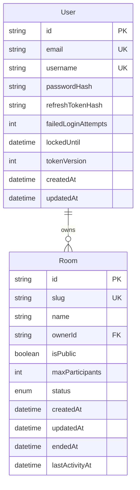

# Domain Model — Entity Relationship

> Сущности базы данных и их связи.



## Text Diagram

```
┌──────────────────────────────────────┐
│                User                  │
├──────────────────────────────────────┤
│ id                  PK  (cuid)       │
│ email               UK               │
│ username            UK               │
│ passwordHash                         │
│ refreshTokenHash    (nullable)       │
│ failedLoginAttempts (default 0)      │
│ lockedUntil         (nullable)       │
│ tokenVersion        (default 0)      │
│ createdAt                            │
│ updatedAt                            │
└──────────────────────┬───────────────┘
                       │ 1
                       │ owns
                       │ 0..*
┌──────────────────────▼───────────────┐
│                Room                  │
├──────────────────────────────────────┤
│ id              PK  (cuid)           │
│ slug            UK  (6-char alphanum)│
│ name            (nullable)           │
│ ownerId         FK → User.id         │
│ isPublic        (default true)       │
│ maxParticipants (default 10)         │
│ status          active | ended       │
│ createdAt                            │
│ updatedAt                            │
│ endedAt         (nullable)           │
│ lastActivityAt  (nullable)           │
└──────────────────────────────────────┘

  %% Message (Stage 9 — planned)
  ┌───────────────────────┐
  │       Message         │
  ├───────────────────────┤
  │ id        PK          │
  │ content               │
  │ userId    FK → User   │
  │ roomId    FK → Room   │
  │ createdAt             │
  └───────────────────────┘
```

## Entities

| Entity | Table | Description |
|--------|-------|-------------|
| **User** | `User` | Registered account. Stores hashed password and hashed refresh token. Owns rooms. |
| **Room** | `Room` | Video call room identified by a unique slug. Owned by one User. Status: `active` or `ended`. |
| **Message** | `Message` | *(Planned — Stage 9)* Chat messages per room. |

## Indexes

| Table | Index | Type |
|-------|-------|------|
| `User` | `email` | Unique |
| `User` | `username` | Unique |
| `Room` | `slug` | Unique |
| `Room` | `ownerId` | B-tree (FK) |
| `Room` | `status` | B-tree |
| `Room` | `isPublic` | B-tree |
