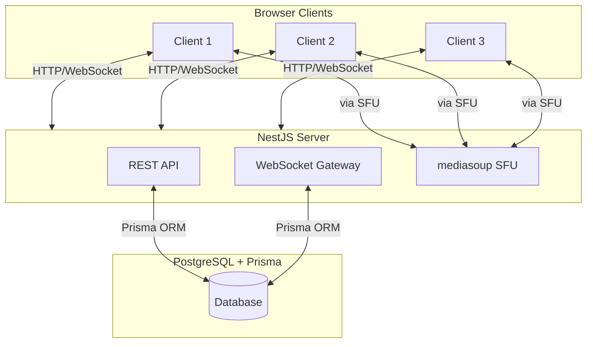

# High-Level Architecture

> Верхнеуровневый обзор взаимодействия клиентов, сервера и базы данных.



## Text Diagram

```
┌──────────────────────────────────────────┐
│             Browser Clients              │
│                                          │
│   [Client 1]  [Client 2]  [Client 3]    │
└────────┬────────────┬────────────┬───────┘
         │            │            │
         │   HTTP / WebSocket      │
         ▼            ▼            ▼
┌──────────────────────────────────────────┐
│              NestJS Server               │
│                                          │
│  ┌──────────┐  ┌─────────────────────┐  │
│  │ REST API │  │ WebSocket Gateway   │  │
│  │ /*      │  │ /sfu namespace      │  │
│  └────┬─────┘  └──────────┬──────────┘  │
│       │                   │             │
│       │         ┌─────────▼──────────┐  │
│       │         │  mediasoup SFU     │  │
│       │  │  (Workers × 1)     │  │
│       │         └────────────────────┘  │
└───────┼───────────────────────────────── ┘
        │ Prisma ORM (TCP :5432)
        ▼
┌──────────────────────────────────────────┐
│         PostgreSQL + Prisma              │
│                                          │
│              [(Database)]               │
│       users · rooms · messages          │
└──────────────────────────────────────────┘

Media flow (RTP/SRTP — bypasses REST/WS path):
  Client 1 ──► SFU ──► Client 2
  Client 1 ──► SFU ──► Client 3
```

## Component Overview

| Component | Description | Location |
|-----------|-------------|----------|
| **REST API** | Auth, user, room management, and chat message endpoints | `apps/server/src/auth/`, `user/`, `room/`, `chat/` |
| **WebSocket Gateway** | SFU signalling and chat events via Socket.io | `apps/server/src/sfu/`, `chat/` |
| **mediasoup SFU** | Single Worker routing media for group calls | `apps/server/src/sfu/` |
| **Rate Limiting** | Global ThrottlerModule tiers: 100/60s, 200/5min, 1000/1hr | `apps/server/src/app.module.ts` |
| **PostgreSQL** | Persistent storage for users, rooms, and messages | Docker service, accessed via Prisma |
| **Browser Clients** | React SPA — auth, room UI, chat, SFU client | `apps/client/src/` |

## Communication Protocols

| Path | Protocol | Purpose |
|------|----------|---------|
| Client → Server (REST) | HTTPS / HTTP/JSON + cookies | Auth, room CRUD, user profile |
| Client → Server (WS) | WSS / Socket.io | SFU signalling (join, transport, produce, consume) |
| Client ↔ SFU | RTP/SRTP over UDP | Media (audio/video) routing through SFU |
| Server → PostgreSQL | TCP (Prisma ORM) | Database reads and writes |
