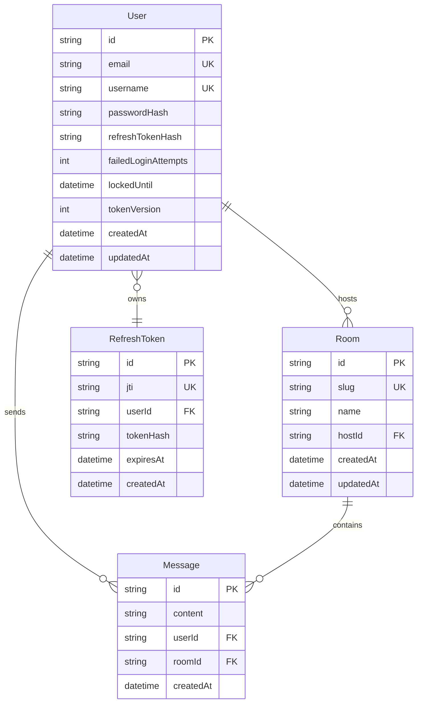
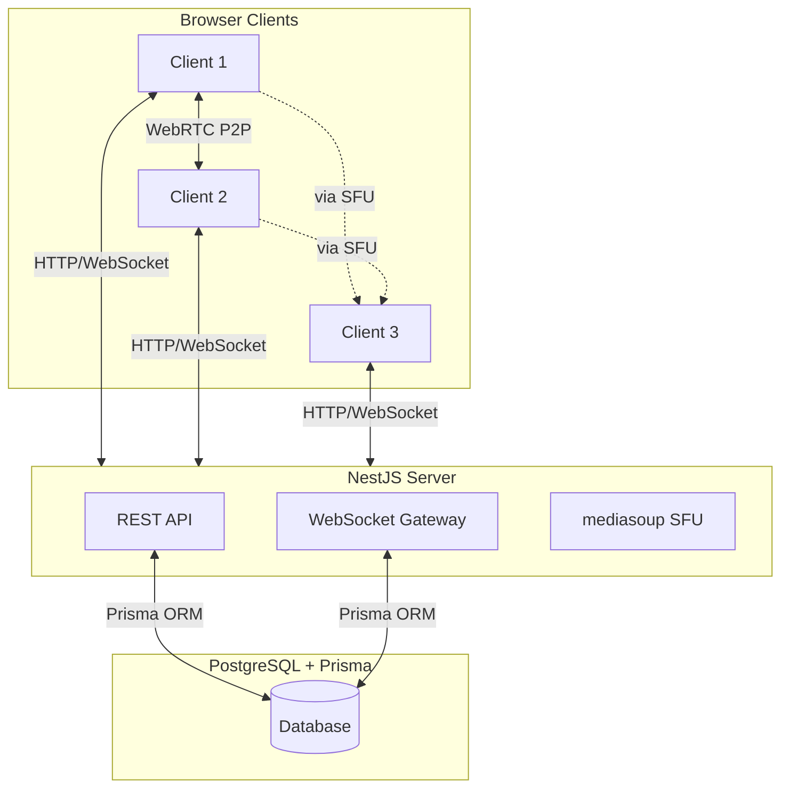

# Architecture Overview

## Problem Statement

Build a browser-based video conferencing system similar to Google Meet that supports:
- 1-on-1 and group video calls (up to 10+ participants)
- Real-time text chat with history
- Screen sharing
- Device management (camera, microphone, speaker switching)
- User authentication

## High-Level Requirements

### Functional Requirements
- Users can register, login, and manage sessions
- Users can create/join video rooms via unique codes
- P2P WebRTC connections for 1-on-1 calls
- SFU (Selective Forwarding Unit) for group calls (3+ participants)
- Real-time signalling via WebSocket
- Text chat with message history

### Non-Functional Requirements
- Video latency: < 200ms (P2P)
- Audio latency: < 150ms (P2P)
- Chat message delivery: < 100ms
- UI frame rate: 60fps with 10+ video tiles
- API response time: < 200ms (p95)

## Domain Model Overview

## System Architecture

### Communication Flows

1. **Authentication Flow**: Client → REST API (login/register) → JWT tokens (HTTP-only cookies)
2. **Room Management**: Client → REST API → CRUD operations on rooms
3. **Signalling**: Client ↔ WebSocket Gateway → offer/answer/ICE exchange
4. **Media (P2P)**: Client ↔ Client (direct WebRTC connection)
5. **Media (Group)**: Client ↔ SFU Server ↔ Client (selective forwarding)

## Tech Stack

### Backend
- **Framework**: NestJS (Node.js)
- **Database**: PostgreSQL 16
- **ORM**: Prisma
- **WebSocket**: Socket.io
- **WebRTC**: mediasoup SFU
- **Auth**: Passport.js + JWT

### Frontend
- **Framework**: React 19
- **Build Tool**: Vite
- **Routing**: React Router v7 (file-based)
- **Styling**: Tailwind CSS v4
- **UI Components**: Radix UI
- **Forms**: React Hook Form + Zod
- **WebRTC**: Native RTCPeerConnection API

### Infrastructure
- **Containerization**: Docker (PostgreSQL)
- **Reverse Proxy**: Caddy (automatic HTTPS)
- **TURN Server**: coturn

## Main Modules

| Module | Purpose | Location |
|--------|---------|----------|
| **AuthModule** | JWT authentication with refresh token rotation | `apps/server/src/auth/` |
| **UserModule** | User management via Prisma | `apps/server/src/user/` |
| **PrismaModule** | Global database service | `apps/server/src/prisma/` |
| **GatewayModule** | WebSocket signalling | `apps/server/src/gateway/` |
| **SFUModule** | mediasoup for group calls | `apps/server/src/sfu/` |
| **Client App** | React 19 + Vite frontend | `apps/client/src/` |

## Security Architecture

### Authentication
- Password hashing with bcrypt (10 rounds)
- JWT access tokens (15 min expiration)
- JWT refresh tokens (7 day expiration)
- HTTP-only cookies for token storage
- Refresh token rotation on every use
- Token reuse detection via SHA256 hashing

### WebRTC Security
- STUN servers for NAT traversal (Google Public STUN)
- TURN server (coturn) for relay candidates
- SRTP (Secure Real-time Transport Protocol) for media
- DTLS (Datagram Transport Layer Security) for data channels

## Scalability Strategy

### SFU Architecture (mediasoup)
- **Worker**: OS process with media capabilities
- **Router**: Routes media for a room (1 Router per room)
- **Transport**: RTP stream (send/receive)
- **Producer**: Incoming media track
- **Consumer**: Outgoing media track

### Horizontal Scaling
- Stateless servers via JWT tokens
- Redis adapter for Socket.io (WebSocket state sync)
- PostgreSQL connection pooling
- Load balancer (Caddy) for distribution

---

## See Also

- [Module Documentation](../modules/) - Detailed module specifications
- [Roadmap](../roadmap.md) - Implementation phases and tasks
- [Agent Guide](../agent-guide.md) - Guidelines for AI agents working on this codebase
