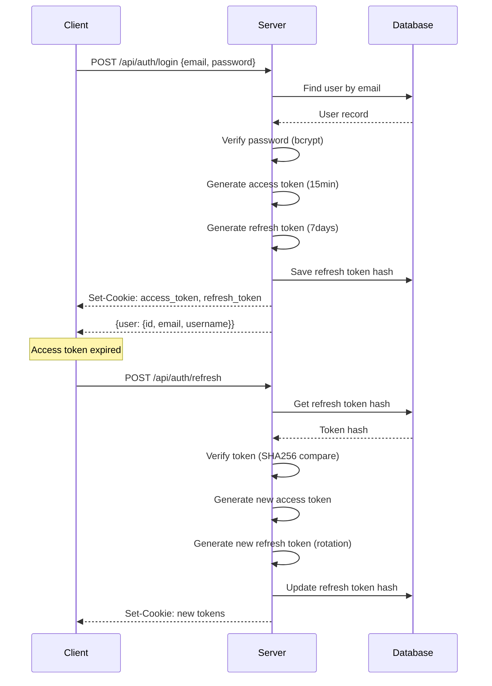

# Sequence: Authentication Flow

> Login, token rotation, and refresh cycle.



## Text Diagram

```
Client                   Server                   Database
  │                         │                         │
  │── POST /api/auth/login ►│                         │
  │   {email, password}     │── Find user by email ──►│
  │                         │◄── User record ─────────│
  │                         │                         │
  │                         │ [verify bcrypt password]│
  │                         │ [generate access token  │
  │                         │  15 min, JWT]           │
  │                         │ [generate refresh token │
  │                         │  7 days, JWT + jti]     │
  │                         │── Save refresh hash ───►│
  │                         │◄── OK ──────────────────│
  │◄── Set-Cookie: ─────────│                         │
  │    access_token (15min) │                         │
  │    refresh_token (7d)   │                         │
  │◄── {user:{id,email,     │                         │
  │     username}} ─────────│                         │
  │                         │                         │
  │  ~~~ access token expires (15 min) ~~~            │
  │                         │                         │
  │── POST /api/auth/refresh►│                         │
  │   (cookie: refresh_token)                         │
  │                         │── Get refresh hash ────►│
  │                         │◄── Token hash ──────────│
  │                         │                         │
  │                         │ [verify SHA256 compare] │
  │                         │ [detect token reuse:    │
  │                         │  revoke all if mismatch]│
  │                         │ [generate new access    │
  │                         │  token]                 │
  │                         │ [rotate refresh token]  │
  │                         │── Update refresh hash ─►│
  │                         │◄── OK ──────────────────│
  │◄── Set-Cookie: new ─────│                         │
  │    access_token         │                         │
  │    refresh_token        │                         │
```

## Step-by-Step Description

### Login

| Step | Description |
|------|-------------|
| 1 | Client POSTs `{email, password}` to `/api/auth/login` |
| 2 | Server looks up user by email via Prisma |
| 3 | bcrypt verifies submitted password against stored hash |
| 4 | Server generates access token (JWT, 15 min, contains `sub`, `email`, `username`, `tokenVersion`) |
| 5 | Server generates refresh token (JWT, 7 days, contains `sub`, `jti`) |
| 6 | Refresh token is SHA256-hashed and saved in `User.refreshTokenHash` |
| 7 | Both tokens are set as HTTP-only, Secure, SameSite=Strict cookies |
| 8 | Response body returns `{user: {id, email, username}}` (no token values) |

### Token Refresh

| Step | Description |
|------|-------------|
| 1 | Client POSTs to `/api/auth/refresh` (refresh token cookie sent automatically) |
| 2 | `JwtRefreshStrategy` validates the JWT signature and expiry |
| 3 | Server loads current `refreshTokenHash` from database |
| 4 | Timing-safe SHA256 comparison detects token reuse |
| 5 | On reuse detection: all tokens invalidated (`tokenVersion` incremented, hash cleared) |
| 6 | New access + refresh tokens generated; refresh token rotated |
| 7 | New tokens set as cookies; old refresh token is invalidated |

## Token Structure

```typescript
// Access Token Payload (JWT)
{
  sub: string,          // User ID
  email: string,
  username: string,
  tokenVersion: number, // Invalidates old tokens on rotation
  iat: number,
  exp: number           // +15 minutes
}

// Refresh Token Payload (JWT)
{
  sub: string,          // User ID
  jti: string,          // Unique token identifier
  iat: number,
  exp: number           // +7 days
}
```

## Security Properties

| Property | Implementation |
|----------|---------------|
| Password storage | bcrypt, 10 rounds |
| Access token lifetime | 15 minutes |
| Refresh token lifetime | 7 days |
| Token transport | HTTP-only cookies (never in JS) |
| Refresh token storage | SHA256 hash only (not plaintext) |
| Token reuse detection | Timing-safe SHA256 comparison |
| Account lockout | After N failed login attempts (`lockedUntil` timestamp) |
