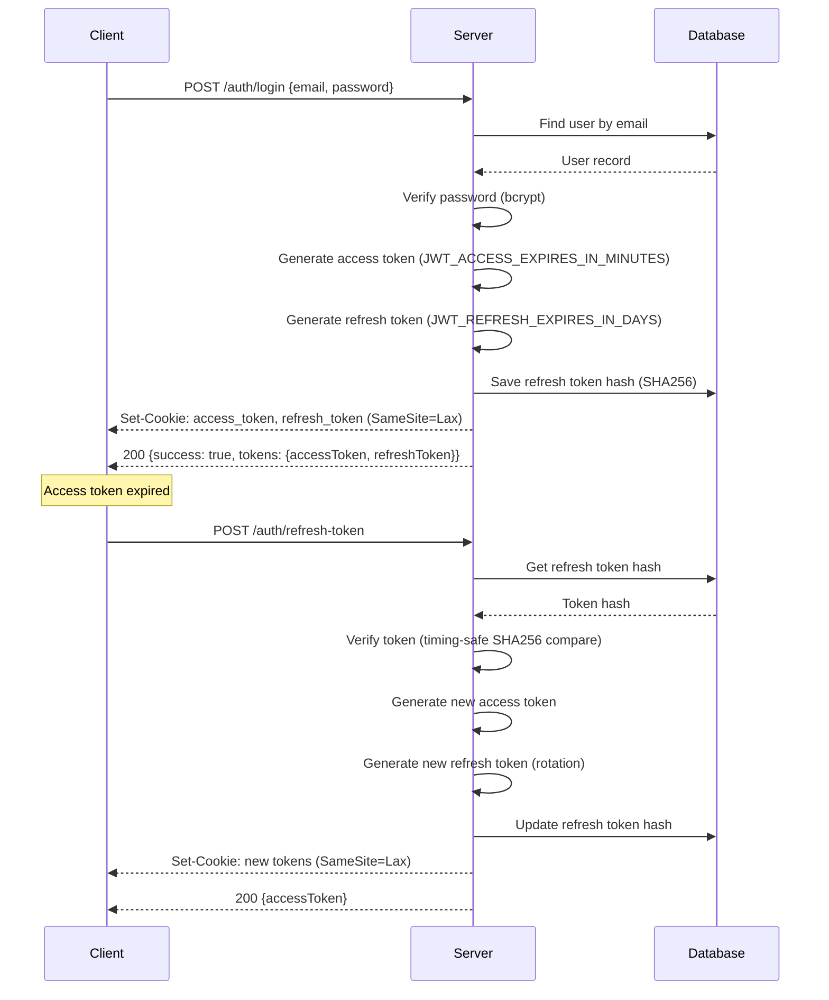

# Sequence: Authentication Flow

> Login, token rotation, and refresh cycle.



## Text Diagram

```
Client                   Server                   Database
  │                         │                         │
  │── POST /auth/login ────►│                         │
  │   {email, password}     │── Find user by email ──►│
  │                         │◄── User record ─────────│
  │                         │                         │
  │                         │ [verify bcrypt password]│
  │                         │ [generate access token  │
  │                         │  JWT_ACCESS_EXPIRES_IN  │
  │                         │  _MINUTES, contains:    │
  │                         │  id, email, role,       │
  │                         │  tokenVersion]          │
  │                         │ [generate refresh token │
  │                         │  JWT_REFRESH_EXPIRES_IN │
  │                         │  _DAYS, contains:       │
  │                         │  id, email, role,       │
  │                         │  tokenVersion, jti]     │
  │                         │── Save refresh hash ───►│
  │                         │◄── OK ──────────────────│
  │◄── Set-Cookie: ─────────│                         │
  │    access_token         │                         │
  │    refresh_token        │                         │
  │    (HttpOnly, Lax)      │                         │
  │◄── 200 {success:true,   │                         │
  │     tokens:{...}} ──────│                         │
  │                         │                         │
  │  ~~~ access token expires ~~~                     │
  │                         │                         │
  │── POST /auth/refresh-  ►│                         │
  │   token                 │── Get refresh hash ────►│
  │   (cookie: refresh_token)                        │
  │                         │◄── Token hash ──────────│
  │                         │                         │
  │                         │ [verify timing-safe     │
  │                         │  SHA256 compare]        │
  │                         │ [detect token reuse:    │
  │                         │  revoke all if mismatch]│
  │                         │ [generate new access    │
  │                         │  token]                 │
  │                         │ [rotate refresh token]  │
  │                         │── Update refresh hash ─►│
  │                         │◄── OK ──────────────────│
  │◄── Set-Cookie: new ─────│                         │
  │    access_token         │                         │
  │    refresh_token        │                         │
  │◄── 200 {accessToken} ───│                         │
```

## Step-by-Step Description

### Login

| Step | Description |
|------|-------------|
| 1 | Client POSTs `{email, password}` to `/auth/login` |
| 2 | Server looks up user by email via Prisma |
| 3 | bcrypt verifies submitted password against stored hash |
| 4 | Server generates access token (JWT, `JWT_ACCESS_EXPIRES_IN_MINUTES`, contains `id`, `email`, `role`, `tokenVersion`) |
| 5 | Server generates refresh token (JWT, `JWT_REFRESH_EXPIRES_IN_DAYS`, contains `id`, `email`, `role`, `tokenVersion`, `jti`) |
| 6 | Refresh token is SHA256-hashed and saved in `User.refreshTokenHash` |
| 7 | Both tokens are set as HTTP-only, Secure (production), SameSite=Lax cookies |
| 8 | Response body returns `{success: true, tokens: {accessToken, refreshToken}}` |

### Token Refresh

| Step | Description |
|------|-------------|
| 1 | Client POSTs to `/auth/refresh-token` (refresh token cookie sent automatically) |
| 2 | `JwtRefreshStrategy` validates the JWT signature, `jti`, `tokenVersion`, and expiry |
| 3 | Server loads current `refreshTokenHash` from database |
| 4 | Timing-safe SHA256 comparison detects token reuse |
| 5 | On reuse detection: all tokens invalidated (`tokenVersion` incremented, hash cleared) |
| 6 | New access + refresh tokens generated; refresh token rotated |
| 7 | New tokens set as cookies; response returns `{accessToken}` (flat, not wrapped in `tokens`) |

## Token Structure

```typescript
// Access Token Payload (JWT)
{
  id: string,          // User ID
  email: string,
  role: Role,          // USER | HOST | ADMIN
  tokenVersion: number,
  iat: number,
  exp: number           // JWT_ACCESS_EXPIRES_IN_MINUTES
}

// Refresh Token Payload (JWT)
{
  id: string,          // User ID
  email: string,
  role: Role,
  tokenVersion: number,
  jti: string,         // Unique token identifier
  iat: number,
  exp: number           // JWT_REFRESH_EXPIRES_IN_DAYS
}
```

> **Note:** `JwtStrategy.validate()` returns `{id, email, role}` to `req.user` — `tokenVersion` is in the JWT but not exposed to controllers.

## Token Extraction

Tokens can be passed via **either** mechanism:
1. **HTTP-only cookies** — `access_token` and `refresh_token` cookies (primary)
2. **Authorization header** — `Bearer <token>` (alternative, e.g., for API testing)

Both `JwtStrategy` and `JwtRefreshStrategy` try **Bearer header first**, then fall back to cookies. However, in `JwtRefreshStrategy`, the raw token for hash comparison is extracted as `cookieToken ?? headerToken` (cookie takes precedence for hash lookup).

## Security Properties

| Property | Implementation |
|----------|---------------|
| Password storage | bcrypt, 10 rounds |
| Access token lifetime | Configurable via `JWT_ACCESS_EXPIRES_IN_MINUTES` (default 15 min) |
| Refresh token lifetime | Configurable via `JWT_REFRESH_EXPIRES_IN_DAYS` (default 7 days) |
| Token transport | HTTP-only cookies (SameSite=Lax, Secure in production) OR Authorization header |
| Refresh token storage | SHA256 hash only (not plaintext) |
| Token reuse detection | Timing-safe SHA256 comparison |
| Account lockout | After 5 failed login attempts, locked for 15 minutes |
| Rate limiting | Register: 5/min, Login: 10/min, Global: 10/60s, 20/5min, 100/1hr |
