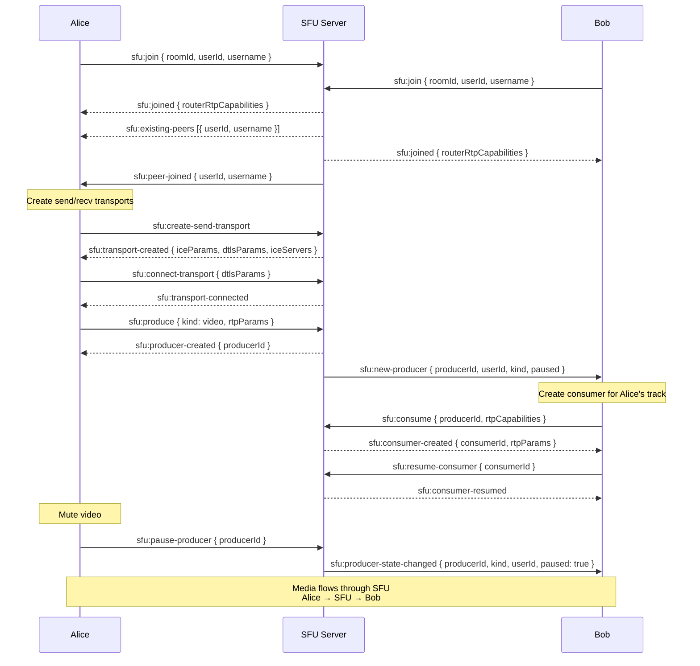

# Sequence: SFU Media Flow (mediasoup)

> Пошаговый handshake от входа в комнату до установки медиапотока между участниками.



## Text Diagram

```
Alice                    SFU Server               Bob
  │                          │                     │
  │──── sfu:join ───────────►│◄─── sfu:join ───────│
  │◄─── sfu:joined ──────────│──── sfu:joined ────►│
  │     {routerRtpCaps}      │     {routerRtpCaps} │
  │                          │                     │
  │  ┌─ Transport setup ─────────────────────────┐ │
  │──┤ sfu:create-send-transport ────────────────►│ │
  │◄─┤ sfu:transport-created {iceParams,dtls} ───│ │
  │──┤ sfu:connect-transport {dtlsParams} ───────►│ │
  │◄─┤ sfu:transport-connected ─────────────────│ │
  │  └───────────────────────────────────────────┘ │
  │                          │                     │
  │──── sfu:produce ────────►│                     │
  │     {kind:video,rtpParams}                     │
  │◄─── sfu:producer-created │                     │
  │     {producerId}         │──── sfu:new-producer►│
  │                          │     {producerId,    │
  │                          │      userId, kind}  │
  │                          │                     │
  │                          │◄─── sfu:consume ────│
  │                          │     {producerId,    │
  │                          │      rtpCaps}       │
  │                          │──── sfu:consumer-  ►│
  │                          │     created         │
  │                          │     {consumerId,    │
  │                          │      rtpParams}     │
  │                          │◄─── sfu:resume-    ─│
  │                          │     consumer        │
  │                          │──── sfu:consumer-  ►│
  │                          │     resumed         │
  │                          │                     │
  │  ══════════ RTP/SRTP media ══════════════════► │
  │             Alice → SFU → Bob                  │
```

## Step-by-Step Description

| Step | Event | Direction | Description |
|------|-------|-----------|-------------|
| 1 | `sfu:join` | Client → Server | Join SFU room. Payload: `{ roomId, userId, username, roomOwnerId? }`. Server creates/retrieves mediasoup Router for the room slug. |
| 2 | `sfu:joined` | Server → Client | Returns `routerRtpCapabilities` — client loads them into mediasoup-client `Device`. |
| 3 | `sfu:existing-peers` | Server → Client | List of peers already in the room at join time: `[{ userId, username }]`. |
| 4 | `sfu:peer-joined` | Server → Peers | Broadcast to existing peers that a new participant joined. |
| 5 | `sfu:create-send-transport` | Client → Server | Request a WebRtcTransport for sending media. |
| 6 | `sfu:transport-created` | Server → Client | ICE + DTLS parameters and ICE servers list for the client to connect. |
| 7 | `sfu:connect-transport` | Client → Server | Client sends its DTLS parameters to complete the handshake. |
| 8 | `sfu:transport-connected` | Server → Client | Transport DTLS handshake done. |
| 9 | `sfu:produce` | Client → Server | Create a Producer for a media track (video or audio). |
| 10 | `sfu:producer-created` | Server → Client | Returns new `producerId` to the sender. |
| 11 | `sfu:new-producer` | Server → Peers | Notify all other room peers that a new consumable track is available (with `paused` state). |
| 12 | `sfu:consume` | Client → Server | Peer requests a Consumer for the new producer. |
| 13 | `sfu:consumer-created` | Server → Client | Consumer created in **paused** state. Client sets up track before resuming. |
| 14 | `sfu:resume-consumer` | Client → Server | Client signals it is ready to receive the track. |
| 15 | `sfu:consumer-resumed` | Server → Client | Consumer is now active; RTP/SRTP media starts flowing. |

## Leave / End Room Events

| Event | Direction | Description |
|-------|-----------|-------------|
| `sfu:leave` | Client → Server | Peer leaves the room voluntarily. |
| `sfu:peer-left` | Server → Clients | Broadcast when a peer disconnects or is kicked. |
| `sfu:kick-peer` | Client → Server | Room owner removes a participant. |
| `sfu:kicked` | Server → Client | Sent to the removed participant before disconnect. |
| `sfu:room-ended` | Server → Clients | Broadcast to all peers when owner ends the room. |

## Producer State Events

| Event | Direction | Description |
|-------|-----------|-------------|
| `sfu:pause-producer` | Client → Server | Client mutes own video or audio. |
| `sfu:resume-producer` | Client → Server | Client unmutes own video or audio. |
| `sfu:close-producer` | Client → Server | Client stops a track entirely (e.g., camera off). |
| `sfu:producer-state-changed` | Server → Peers | Broadcast to room when a producer is paused or resumed: `{ producerId, kind, userId, paused }`. |
